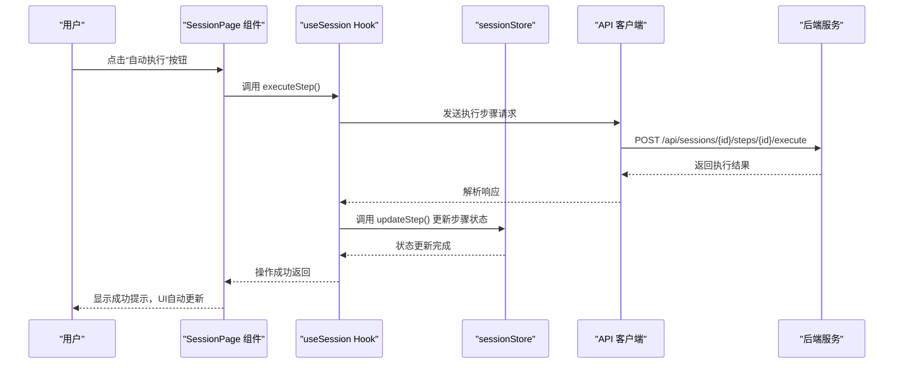
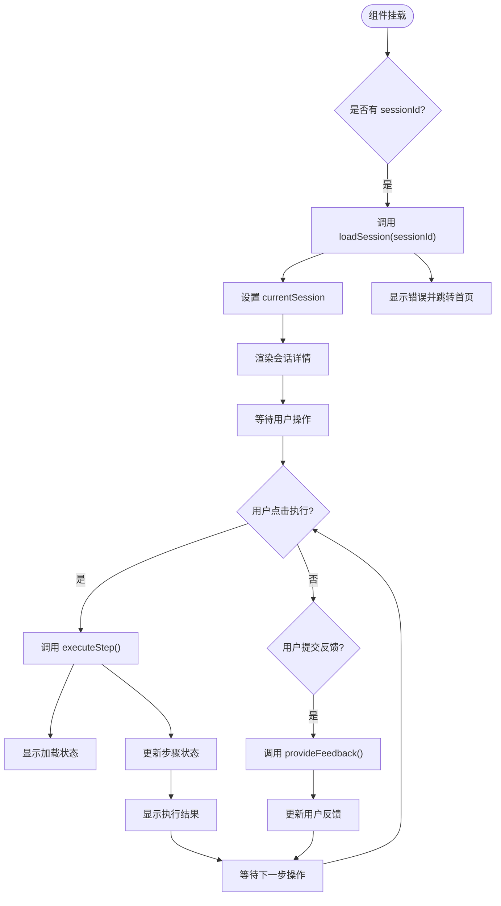
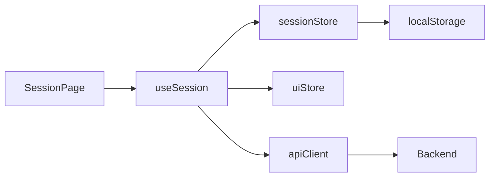

# 会话状态管理

<cite>
**Referenced Files in This Document**   
- [sessionStore.ts](file://frontend/src/stores/sessionStore.ts)
- [SessionPage.tsx](file://frontend/src/pages/SessionPage.tsx)
- [useSession.ts](file://frontend/src/hooks/useSession.ts)
- [index.ts](file://frontend/src/types/index.ts)
</cite>

## 目录
1. [简介](#简介)
2. [核心组件分析](#核心组件分析)
3. [架构概览](#架构概览)
4. [详细组件分析](#详细组件分析)
5. [依赖关系分析](#依赖关系分析)
6. [性能考量](#性能考量)
7. [故障排除指南](#故障排除指南)
8. [结论](#结论)

## 简介
本文档深入探讨了智能运维助手应用程序中的会话状态管理系统。该系统基于Zustand状态管理库构建，负责维护用户处置会话的核心状态，包括当前会话信息、执行步骤列表、会话进度等关键数据。文档将重点分析`sessionStore`的设计与实现，说明其如何通过定义清晰的actions来管理会话生命周期，并结合`SessionPage`组件的实际调用场景，展示状态变更如何驱动UI更新。

## 核心组件分析

本系统的核心在于`sessionStore`的状态管理设计，它不仅维护了当前会话的完整状态树，还提供了丰富的操作接口来响应用户交互和后端事件。`useSession`自定义Hook作为业务逻辑层与状态存储层之间的桥梁，封装了复杂的异步操作，为UI组件提供简洁的API。

**Section sources**
- [sessionStore.ts](file://frontend/src/stores/sessionStore.ts#L50-L163)
- [useSession.ts](file://frontend/src/hooks/useSession.ts#L7-L175)

## 架构概览

```mermaid
graph TD
subgraph "前端 UI 层"
SessionPage[SessionPage 组件]
useSessionHook[useSession Hook]
end
subgraph "状态管理层"
sessionStore[sessionStore (Zustand)]
uiStore[uiStore (Zustand)]
end
subgraph "服务层"
apiClient[API 客户端]
end
subgraph "后端 API"
Backend[(后端服务)]
end
SessionPage --> useSessionHook
useSessionHook --> sessionStore
useSessionHook --> uiStore
useSessionHook --> apiClient
apiClient --> Backend
sessionStore -.->|持久化| LocalStorage[(本地存储)]
```

**Diagram sources **
- [sessionStore.ts](file://frontend/src/stores/sessionStore.ts#L50-L163)
- [useSession.ts](file://frontend/src/hooks/useSession.ts#L7-L175)
- [SessionPage.tsx](file://frontend/src/pages/SessionPage.tsx#L18-L349)

## 详细组件分析

### sessionStore 设计与实现

`sessionStore`是整个会话管理系统的基石，它使用Zustand库创建了一个全局可访问的状态容器。该store的设计体现了良好的关注点分离原则，将状态(state)与操作(actions)明确区分开来。

#### 状态结构
store维护了两类主要状态：
1. **当前会话状态**：`currentSession`, `currentSessionStatus`, `isSessionLoading`
2. **会话列表状态**：`sessions`, `totalSessions`, `currentPage`, `searchQuery`, `statusFilter`

这种设计使得单个会话页面和会话列表页面可以共享同一个状态源，保证了数据的一致性。

#### 持久化策略
通过Zustand的`persist`中间件，store实现了选择性持久化。只有搜索条件(`searchQuery`)、过滤器(`statusFilter`, `categoryFilter`)和分页信息(`currentPage`, `pageSize`)被保存到localStorage中，而敏感的会话数据则保持在内存中，既提升了用户体验（保留用户的筛选偏好），又保障了数据安全。

```mermaid
classDiagram
class SessionState {
+currentSession : Session | null
+currentSessionStatus : SessionStatus | null
+isSessionLoading : boolean
+sessionError : string | null
+sessions : Session[]
+isSessionsLoading : boolean
+sessionsError : string | null
+totalSessions : number
+currentPage : number
+pageSize : number
+searchQuery : string
+statusFilter : string
+categoryFilter : string
+setCurrentSession(session) : void
+setCurrentSessionStatus(status) : void
+setSessionLoading(loading) : void
+setSessionError(error) : void
+setSessions(sessions) : void
+addSession(session) : void
+updateSession(sessionId, updates) : void
+removeSession(sessionId) : void
+setSessionsLoading(loading) : void
+setSessionsError(error) : void
+setTotalSessions(total) : void
+setSearchQuery(query) : void
+setStatusFilter(filter) : void
+setCategoryFilter(filter) : void
+setCurrentPage(page) : void
+updateStep(stepId, updates) : void
+reset() : void
}
class Session {
+session_id : string
+problem_category : string
+problem_description : string
+status : 'processing' | 'completed' | 'aborted'
+created_at : string
+updated_at : string
+user_id? : string
+metadata? : Record<string, any>
+steps : Step[]
+progress : { total_steps, completed_steps, current_step }
}
class Step {
+step_id : string
+session_id : string
+step_order : number
+step_type : 'auto' | 'manual' | 'branch' | 'conditional'
+step_content : string
+tool_api? : string
+execution_status : 'pending' | 'executing' | 'completed' | 'failed' | 'skipped'
+execution_result? : any
+user_feedback? : string
+dependencies : string[]
+timeout : number
+retry_count : number
+max_retries : number
+created_at : string
+updated_at : string
+started_at? : string
+completed_at? : string
+duration? : number
}
SessionState --> Session : "包含"
Session --> Step : "包含多个"
```

**Diagram sources **
- [sessionStore.ts](file://frontend/src/stores/sessionStore.ts#L50-L163)
- [index.ts](file://frontend/src/types/index.ts#L1-L179)

**Section sources**
- [sessionStore.ts](file://frontend/src/stores/sessionStore.ts#L50-L163)

### useSession Hook 分析

`useSession`是一个自定义React Hook，它封装了与`sessionStore`和后端API的交互逻辑，为UI组件提供了更高层次的抽象。

#### 核心功能
- **状态订阅**：从`sessionStore`中解构出需要的状态变量
- **异步操作封装**：将API调用与状态更新逻辑封装在一起
- **副作用处理**：使用`useEffect`实现会话状态的自动轮询刷新

#### 关键操作流程
当用户在`SessionPage`上点击"自动执行"按钮时，触发以下流程：



**Diagram sources **
- [useSession.ts](file://frontend/src/hooks/useSession.ts#L7-L175)
- [sessionStore.ts](file://frontend/src/stores/sessionStore.ts#L50-L163)
- [SessionPage.tsx](file://frontend/src/pages/SessionPage.tsx#L18-L349)

**Section sources**
- [useSession.ts](file://frontend/src/hooks/useSession.ts#L7-L175)

### SessionPage 组件分析

`SessionPage`是会话状态的最终呈现者，它通过`useSession` Hook订阅状态变化，并根据当前会话状态渲染相应的UI。

#### 状态驱动的UI更新
组件的渲染完全由`sessionStore`中的状态驱动：
- 当`isLoading`为true时，显示加载动画
- 当`currentSession`为空时，显示"会话不存在"的错误页面
- 根据每个步骤的`execution_status`动态渲染不同的状态图标和操作按钮

#### 实际调用场景


**Diagram sources **
- [SessionPage.tsx](file://frontend/src/pages/SessionPage.tsx#L18-L349)
- [useSession.ts](file://frontend/src/hooks/useSession.ts#L7-L175)

**Section sources**
- [SessionPage.tsx](file://frontend/src/pages/SessionPage.tsx#L18-L349)

## 依赖关系分析



**Diagram sources **
- [sessionStore.ts](file://frontend/src/stores/sessionStore.ts#L