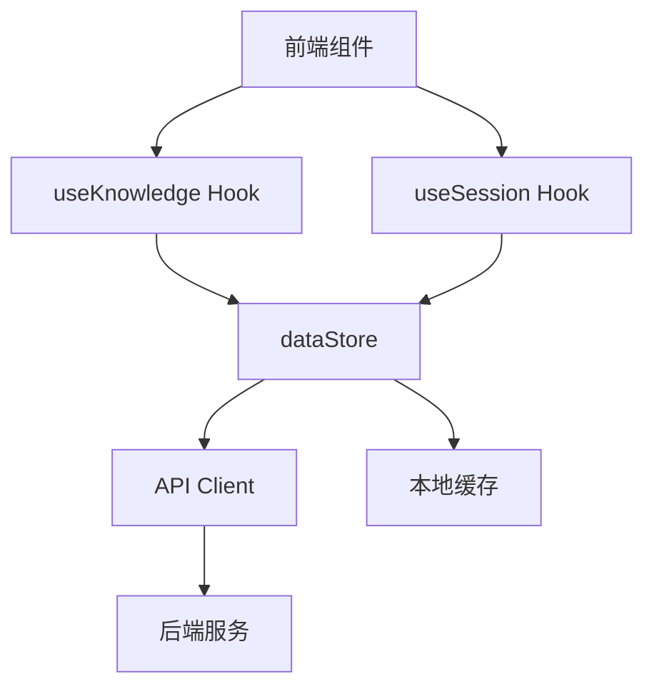
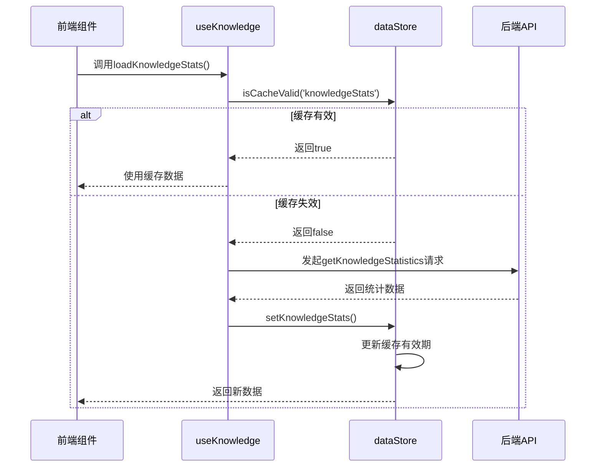
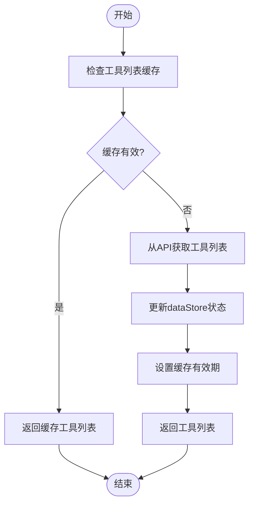
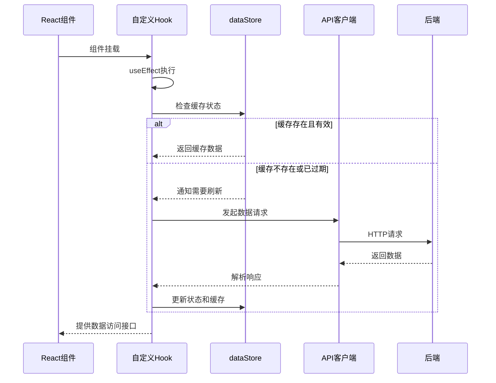
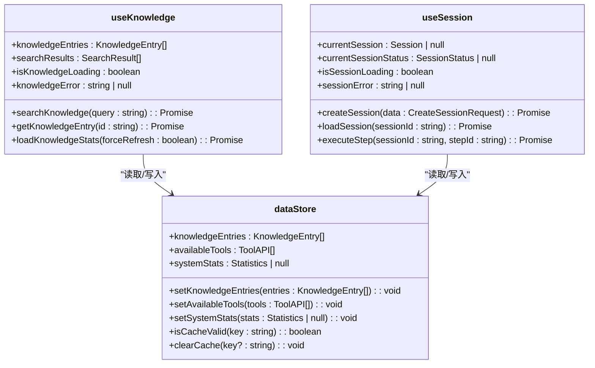

# 数据状态管理

<cite>
**本文档中引用的文件**
- [dataStore.ts](file://frontend\src\stores\dataStore.ts)
- [useKnowledge.ts](file://frontend\src\hooks\useKnowledge.ts)
- [useSession.ts](file://frontend\src\hooks\useSession.ts)
- [api.ts](file://frontend\src\utils\api.ts)
</cite>

## 目录
1. [数据存储核心机制](#数据存储核心机制)
2. [知识库条目缓存策略](#知识库条目缓存策略)
3. [LLM配置信息管理](#llm配置信息管理)
4. [初始化数据加载流程](#初始化数据加载流程)
5. [手动刷新缓存机制](#手动刷新缓存机制)
6. [自定义Hook使用方式](#自定义hook使用方式)
7. [数据一致性处理](#数据一致性处理)
8. [错误边界设计](#错误边界设计)

## 数据存储核心机制

前端应用通过 `dataStore` 实现全局数据状态管理，采用 Zustand 库创建集中式状态容器。该存储负责管理知识库条目、工具信息和系统统计等共享数据，通过状态持久化和缓存机制减少重复API请求，提升应用性能。

**图示来源**
- [dataStore.ts](file://frontend\src\stores\dataStore.ts#L57-L173)
- [useKnowledge.ts](file://frontend\src\hooks\useKnowledge.ts#L6-L184)
- [useSession.ts](file://frontend\src\hooks\useSession.ts#L7-L175)

**本节来源**
- [dataStore.ts](file://frontend\src\stores\dataStore.ts#L1-L192)

## 知识库条目缓存策略

`dataStore` 通过 `knowledgeEntries` 状态字段缓存知识库条目，并结合缓存有效期机制确保数据新鲜度。当调用 `setKnowledgeEntries` 方法时，不仅更新条目数据，还会自动设置对应的缓存过期时间。

缓存超时时间默认设置为5分钟（300000毫秒），在此期间内对相同数据的访问将直接从本地状态获取，避免不必要的网络请求。缓存验证通过 `isCacheValid` 方法实现，检查指定键的缓存是否仍在有效期内。

**图示来源**
- [dataStore.ts](file://frontend\src\stores\dataStore.ts#L88-L131)
- [useKnowledge.ts](file://frontend\src\hooks\useKnowledge.ts#L145-L165)

**本节来源**
- [dataStore.ts](file://frontend\src\stores\dataStore.ts#L57-L173)
- [useKnowledge.ts](file://frontend\src\hooks\useKnowledge.ts#L145-L165)

## LLM配置信息管理

虽然代码中未直接体现LLM配置信息的具体存储结构，但通过类似的模式可以推断其管理方式。系统通过 `availableTools` 和 `toolDetails` 状态字段管理工具相关信息，这些工具很可能与LLM集成相关。

`setAvailableTools` 方法在更新工具列表的同时会重置相应的缓存有效期，确保数据的一致性。对于特定工具的详细信息，则通过 `setToolDetails` 方法进行管理，采用对象映射的方式存储不同工具ID对应的数据。

**图示来源**
- [dataStore.ts](file://frontend\src\stores\dataStore.ts#L88-L131)
- [useKnowledge.ts](file://frontend\src\hooks\useKnowledge.ts#L185-L215)

**本节来源**
- [dataStore.ts](file://frontend\src\stores\dataStore.ts#L57-L173)
- [useKnowledge.ts](file://frontend\src\hooks\useKnowledge.ts#L185-L235)

## 初始化数据加载流程

应用初始化时，通过自定义Hook中的 `useEffect` 钩子自动触发数据加载。以 `useKnowledge` 为例，在组件挂载时会自动调用 `loadKnowledgeStats` 方法，检查缓存有效性并决定是否需要从后端获取最新数据。

这种惰性加载策略确保了应用启动时能够快速呈现界面，同时在后台静默获取必要的数据。API客户端封装了统一的请求处理逻辑，包括认证信息添加、错误处理和用户提示等功能。

**图示来源**
- [useKnowledge.ts](file://frontend\src\hooks\useKnowledge.ts#L175-L184)
- [api.ts](file://frontend\src\utils\api.ts#L1-L234)

**本节来源**
- [useKnowledge.ts](file://frontend\src\hooks\useKnowledge.ts#L175-L184)
- [api.ts](file://frontend\src\utils\api.ts#L1-L234)

## 手动刷新缓存机制

系统提供了灵活的手动刷新机制，允许用户强制更新缓存数据。关键方法如 `loadKnowledgeStats`、`loadAvailableTools` 等都接受一个 `forceRefresh` 参数，当设置为 `true` 时将忽略缓存有效性检查，直接发起API请求获取最新数据。

此外，`clearCache` 方法提供了更精细的缓存控制能力，既可以清除特定键的缓存，也可以清空所有缓存数据。系统还实现了定时器机制，每分钟检查一次缓存状态，自动清理已过期的缓存项。

**本节来源**
- [dataStore.ts](file://frontend\src\stores\dataStore.ts#L127-L192)
- [useKnowledge.ts](file://frontend\src\hooks\useKnowledge.ts#L145-L165)

## 自定义Hook使用方式

系统通过 `useKnowledge` 和 `useSession` 等自定义Hook提供安全的数据访问接口。这些Hook封装了复杂的状态管理和错误处理逻辑，使组件能够以声明式的方式访问共享状态。

组件通过解构语法获取所需的状态和操作方法，无需关心底层实现细节。Hook内部利用React的依赖追踪机制，确保只有当相关状态发生变化时才会触发重新渲染，优化了性能表现。

**图示来源**
- [useKnowledge.ts](file://frontend\src\hooks\useKnowledge.ts#L6-L184)
- [useSession.ts](file://frontend\src\hooks\useSession.ts#L7-L175)
- [dataStore.ts](file://frontend\src\stores\dataStore.ts#L57-L173)

**本节来源**
- [useKnowledge.ts](file://frontend\src\hooks\useKnowledge.ts#L6-L184)
- [useSession.ts](file://frontend\src\hooks\useSession.ts#L7-L175)

## 数据一致性处理

系统通过多种机制确保数据一致性。首先，所有状态更新都通过store提供的action方法进行，保证了状态变更的可追踪性。其次，每当更新主要数据状态时，都会同步更新对应的缓存有效期。

对于会话相关的状态，系统实现了自动刷新机制。当会话处于"processing"状态时，每10秒自动调用 `loadSessionStatus` 获取最新状态，确保用户界面与后端实际状态保持同步。

**本节来源**
- [dataStore.ts](file://frontend\src\stores\dataStore.ts#L57-L173)
- [useSession.ts](file://frontend\src\hooks\useSession.ts#L155-L175)

## 错误边界设计

系统在多个层面实现了完善的错误处理机制。API客户端内置了响应拦截器，能够捕获各类HTTP错误并根据状态码显示相应的用户提示。自定义Hook中的异步方法均使用try-catch包裹，确保错误不会导致应用崩溃。

状态管理store维护了专门的错误状态字段（如 `knowledgeError`、`toolsError` 等），组件可以根据这些状态字段决定如何呈现错误信息。Toast通知系统提供了即时的用户反馈，增强了用户体验。

**本节来源**
- [api.ts](file://frontend\src\utils\api.ts#L1-L234)
- [useKnowledge.ts](file://frontend\src\hooks\useKnowledge.ts#L25-L45)
- [useSession.ts](file://frontend\src\hooks\useSession.ts#L25-L45)