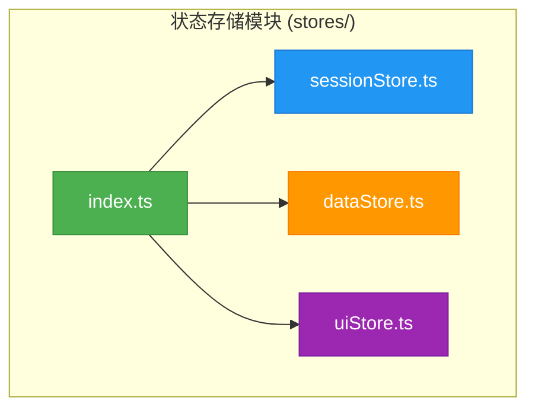
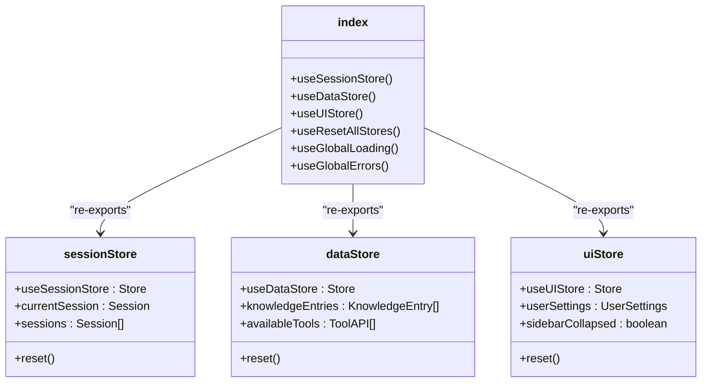
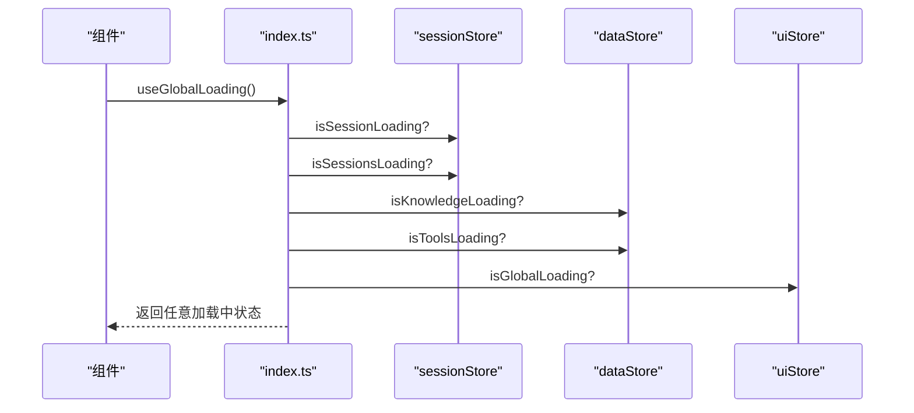
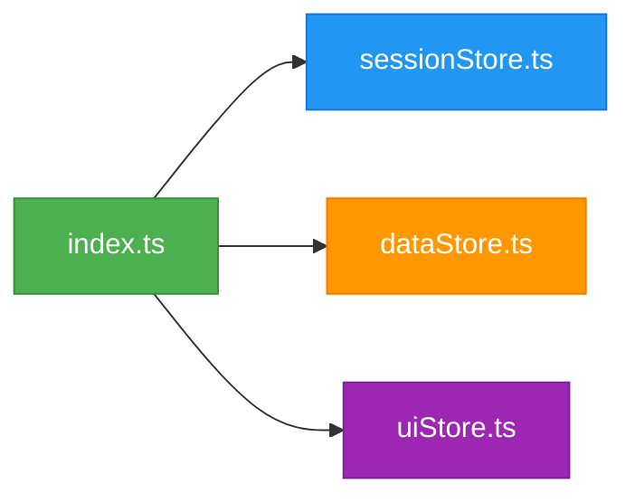

# 状态模块组织方式

<cite>
**本文档中引用的文件**  
- [index.ts](file://frontend/src/stores/index.ts)
- [sessionStore.ts](file://frontend/src/stores/sessionStore.ts)
- [dataStore.ts](file://frontend/src/stores/dataStore.ts)
- [uiStore.ts](file://frontend/src/stores/uiStore.ts)
</cite>

## 目录
1. [简介](#简介)
2. [项目结构](#项目结构)
3. [核心组件](#核心组件)
4. [架构概述](#架构概述)
5. [详细组件分析](#详细组件分析)
6. [依赖分析](#依赖分析)
7. [性能考虑](#性能考虑)
8. [故障排除指南](#故障排除指南)
9. [结论](#结论)

## 简介
本项目为一个智能运维助手应用程序，前端采用 TypeScript 和 Zustand 状态管理库构建。状态模块通过 `index.ts` 统一导出多个独立的状态存储（store），包括会话、数据和 UI 状态，实现了模块化、可维护性强的设计。该设计支持类型推断、便于测试，并通过组合式 Hook 提供了便捷的全局状态访问方式。

## 项目结构
状态管理模块位于 `frontend/src/stores/` 目录下，包含三个主要状态存储文件及一个统一入口文件：

```
frontend/
└── src/
    └── stores/
        ├── sessionStore.ts     # 会话相关状态
        ├── dataStore.ts        # 数据与知识库状态
        ├── uiStore.ts          # 用户界面状态
        └── index.ts            # 统一导出入口
```

这种分层结构将不同职责的状态分离到独立文件中，提升了代码的可读性和可维护性。



**图示来源**
- [index.ts](file://frontend/src/stores/index.ts)
- [sessionStore.ts](file://frontend/src/stores/sessionStore.ts)
- [dataStore.ts](file://frontend/src/stores/dataStore.ts)
- [uiStore.ts](file://frontend/src/stores/uiStore.ts)

**节来源**
- [index.ts](file://frontend/src/stores/index.ts)
- [sessionStore.ts](file://frontend/src/stores/sessionStore.ts)
- [dataStore.ts](file://frontend/src/stores/dataStore.ts)
- [uiStore.ts](file://frontend/src/stores/uiStore.ts)

## 核心组件
状态模块的核心由四个文件构成：`sessionStore.ts`、`dataStore.ts`、`uiStore.ts` 和 `index.ts`。其中前三个分别管理应用的会话逻辑、业务数据和用户界面状态，而 `index.ts` 作为聚合入口，提供统一的导入接口和组合式 Hook。

**节来源**
- [index.ts](file://frontend/src/stores/index.ts)
- [sessionStore.ts](file://frontend/src/stores/sessionStore.ts)
- [dataStore.ts](file://frontend/src/stores/dataStore.ts)
- [uiStore.ts](file://frontend/src/stores/uiStore.ts)

## 架构概述
整个状态模块采用模块化设计，各 store 职责分明：
- `sessionStore`：管理用户会话生命周期、当前会话内容及会话列表。
- `dataStore`：管理知识库条目、可用工具、系统统计等共享数据资源。
- `uiStore`：管理侧边栏展开状态、主题设置、模态框控制等 UI 偏好。

`index.ts` 文件不定义具体状态，而是作为“门面模式”（Facade Pattern）的实现，对外暴露所有 store 及其组合功能，隐藏内部复杂性。



**图示来源**
- [index.ts](file://frontend/src/stores/index.ts)
- [sessionStore.ts](file://frontend/src/stores/sessionStore.ts)
- [dataStore.ts](file://frontend/src/stores/dataStore.ts)
- [uiStore.ts](file://frontend/src/stores/uiStore.ts)

## 详细组件分析

### index.ts 入口设计分析
`index.ts` 的主要设计意图是作为状态模块的单一入口点，避免使用者直接引用深层路径，从而降低耦合度并提升重构灵活性。

#### 设计优势
1. **简化导入路径**：组件可通过 `import { useSessionStore } from '@/stores'` 直接使用，无需关心具体实现位置。
2. **支持懒加载优化**：当某些 store 不被使用时，Tree-shaking 可自动移除未引用的部分。
3. **增强类型推断**：TypeScript 能准确推断从 `index.ts` 导出的所有类型，确保开发体验流畅。
4. **便于测试隔离**：单元测试可轻松 mock 单个 store 而不影响其他模块。

#### 组合式 Hook 实现
`index.ts` 还提供了多个高阶 Hook，用于跨 store 状态聚合：



**图示来源**
- [index.ts](file://frontend/src/stores/index.ts)
- [sessionStore.ts](file://frontend/src/stores/sessionStore.ts)
- [dataStore.ts](file://frontend/src/stores/dataStore.ts)
- [uiStore.ts](file://frontend/src/stores/uiStore.ts)

**节来源**
- [index.ts](file://frontend/src/stores/index.ts#L1-L54)

### 模块化设计带来的好处
#### 便于测试
每个 store 是独立的函数式模块，可在测试中单独导入并验证其行为。例如，`useSessionStore` 的 `reset()` 方法可以独立测试而不影响 UI 或数据状态。

#### 支持懒加载
由于采用了 ES6 模块语法和静态导出，打包工具（如 Vite）能够识别未使用的导出并进行 Tree-shaking，有效减少生产包体积。

#### 类型推断支持
TypeScript 结合 Zustand 的泛型机制，使得每个 store 的状态结构和 action 类型都能被精确推断，极大提升了开发效率和安全性。

**节来源**
- [index.ts](file://frontend/src/stores/index.ts)
- [sessionStore.ts](file://frontend/src/stores/sessionStore.ts)
- [dataStore.ts](file://frontend/src/stores/dataStore.ts)
- [uiStore.ts](file://frontend/src/stores/uiStore.ts)

### 新组件中的标准使用范式
在新组件中应遵循以下标准范式导入和使用 store：

```typescript
// ✅ 推荐做法：通过统一入口导入
import { useSessionStore, useGlobalLoading } from '@/stores'

function MyComponent() {
  const currentSession = useSessionStore(state => state.currentSession)
  const isLoading = useGlobalLoading()

  return <div>{isLoading ? '加载中...' : currentSession?.title}</div>
}
```

避免直接导入具体 store 文件路径，以保持与模块封装的一致性。

**节来源**
- [index.ts](file://frontend/src/stores/index.ts)

### 循环依赖风险与规避策略
若在某个 store 中反向导入 `index.ts`，可能导致循环依赖问题。例如：

```ts
// ❌ 错误示例：sessionStore.ts 中导入 index.ts
import { useResetAllStores } from './index' // 循环依赖！
```

#### 规避策略
1. **禁止反向引用**：store 实现文件不得导入 `index.ts`。
2. **提取公共逻辑**：若需共享逻辑，应将其提取至 `utils/` 目录下。
3. **使用依赖注入或事件机制**：对于跨 store 协作场景，建议通过发布-订阅模式解耦。

**节来源**
- [index.ts](file://frontend/src/stores/index.ts)

## 依赖分析
状态模块内部依赖清晰，仅 `index.ts` 依赖其余三个 store 文件，形成单向依赖流。



**图示来源**
- [index.ts](file://frontend/src/stores/index.ts)
- [sessionStore.ts](file://frontend/src/stores/sessionStore.ts)
- [dataStore.ts](file://frontend/src/stores/dataStore.ts)
- [uiStore.ts](file://frontend/src/stores/uiStore.ts)

**节来源**
- [index.ts](file://frontend/src/stores/index.ts)

## 性能考虑
- 所有 store 均基于 Zustand 实现，具备细粒度更新能力，避免不必要的重渲染。
- `persist` 中间件仅持久化必要字段（如搜索条件、页面设置），减少本地存储开销。
- `dataStore` 内置缓存机制，防止频繁请求重复数据。

## 故障排除指南
- 若发现状态未正确更新，请检查 selector 是否返回新引用。
- 若出现循环依赖错误，请审查是否有 store 文件导入了 `index.ts`。
- 若持久化失效，请确认 `name` 字段唯一且 `partialize` 配置正确。

**节来源**
- [sessionStore.ts](file://frontend/src/stores/sessionStore.ts)
- [dataStore.ts](file://frontend/src/stores/dataStore.ts)
- [uiStore.ts](file://frontend/src/stores/uiStore.ts)

## 结论
`index.ts` 作为状态模块的统一入口，体现了良好的模块化设计思想。它不仅简化了外部使用方式，还通过组合式 Hook 提供了强大的状态聚合能力。该架构支持类型安全、易于测试、利于优化，是现代前端状态管理的最佳实践之一。