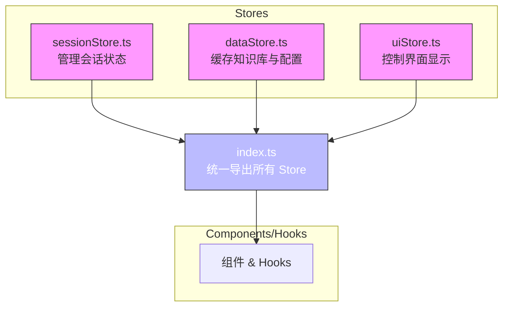
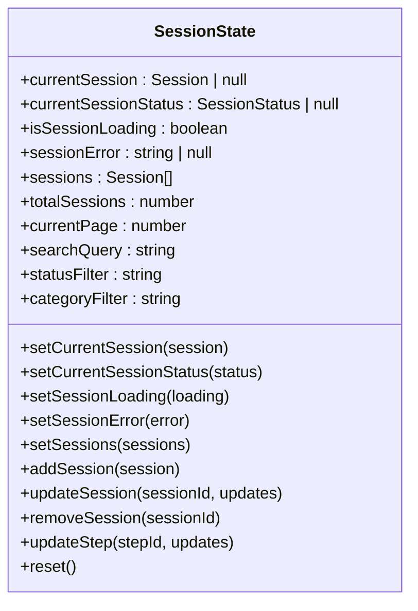
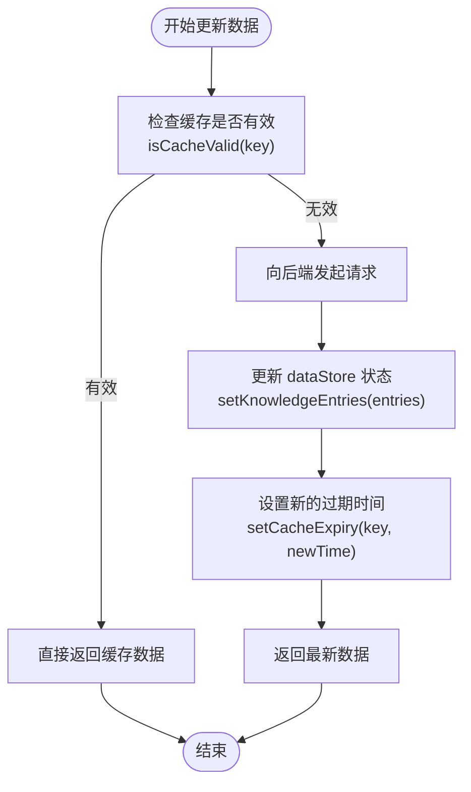
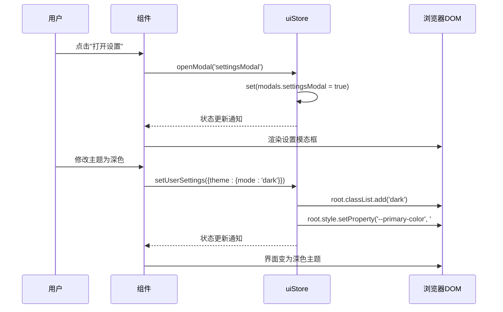

# 状态管理

<cite>
**本文档中引用的文件**  
- [sessionStore.ts](file://frontend/src/stores/sessionStore.ts)
- [dataStore.ts](file://frontend/src/stores/dataStore.ts)
- [uiStore.ts](file://frontend/src/stores/uiStore.ts)
- [index.ts](file://frontend/src/stores/index.ts)
- [useSession.ts](file://frontend/src/hooks/useSession.ts)
</cite>

## 目录
1. [简介](#简介)
2. [状态模块组织结构](#状态模块组织结构)
3. [会话状态管理 (sessionStore)](#会话状态管理-sessionstore)
4. [数据缓存管理 (dataStore)](#数据缓存管理-datastore)
5. [界面状态控制 (uiStore)](#界面状态控制-uistore)
6. [状态更新流程分析](#状态更新流程分析)
7. [组合式 Hook 与全局状态](#组合式-hook-与全局状态)
8. [持久化与缓存策略](#持久化与缓存策略)
9. [调试技巧与状态快照](#调试技巧与状态快照)
10. [总结](#总结)

## 简介
本专项文档详细阐述了项目中基于 Zustand 的状态管理实践。系统介绍了 `sessionStore`、`dataStore` 和 `uiStore` 三个核心状态模块的设计与实现，涵盖其状态结构、行为逻辑、模块化组织方式以及统一导出机制。重点解析了当接收到新的 LLM 响应时，如何通过 action 方法触发状态更新并自动刷新相关 UI 组件的完整流程。

**Section sources**
- [sessionStore.ts](file://frontend/src/stores/sessionStore.ts#L1-L163)
- [dataStore.ts](file://frontend/src/stores/dataStore.ts#L1-L192)
- [uiStore.ts](file://frontend/src/stores/uiStore.ts#L1-L235)

## 状态模块组织结构
项目的前端状态管理采用模块化设计，所有 store 文件集中存放于 `frontend/src/stores/` 目录下。每个 store 负责管理特定领域的应用状态，并通过 `index.ts` 文件进行统一聚合和导出，为其他组件提供清晰、一致的访问接口。

**Diagram sources**
- [sessionStore.ts](file://frontend/src/stores/sessionStore.ts)
- [dataStore.ts](file://frontend/src/stores/dataStore.ts)
- [uiStore.ts](file://frontend/src/stores/uiStore.ts)
- [index.ts](file://frontend/src/stores/index.ts)

**Section sources**
- [index.ts](file://frontend/src/stores/index.ts#L1-L54)

## 会话状态管理 (sessionStore)
`sessionStore` 是应用的核心状态模块之一，负责管理当前会话及其相关的所有状态信息。

### 核心状态字段
该 store 定义了全面的状态结构，主要包括：
- **当前会话**: `currentSession` 存储完整的会话对象，包含 `sessionId`、`steps`（步骤列表）等。
- **会话元信息**: `currentSessionStatus` 跟踪会话的实时处理状态（如 'pending', 'processing', 'completed'）。
- **加载与错误**: `isSessionLoading` 和 `sessionError` 用于控制加载指示器和错误提示。
- **会话列表**: `sessions` 数组存储用户的历史会话记录，支持分页 (`currentPage`, `pageSize`) 和过滤 (`searchQuery`, `statusFilter`)。

### 关键 Action 方法
store 提供了一系列 action 方法来安全地修改状态：
- `setCurrentSession(session)`: 设置当前激活的会话。
- `updateStep(stepId, updates)`: 更新指定步骤的属性（如执行结果、状态），此方法在接收到 LLM 响应后被调用。
- `addSession(session)`: 将新创建的会话添加到会话列表头部。
- `reset()`: 将 store 恢复到初始空状态。

**Diagram sources**
- [sessionStore.ts](file://frontend/src/stores/sessionStore.ts#L1-L163)

**Section sources**
- [sessionStore.ts](file://frontend/src/stores/sessionStore.ts#L1-L163)

## 数据缓存管理 (dataStore)
`dataStore` 专注于缓存从后端获取的静态或半静态数据，以提升应用性能和用户体验。

### 缓存内容
该 store 主要管理以下三类数据：
- **知识库内容**: `knowledgeEntries` 存储从 `knowledge-base` 目录加载的操作规程和 API 文档。
- **LLM 配置**: `availableTools` 和 `toolDetails` 缓存可用的工具 API 列表及其详细信息。
- **系统统计**: `systemStats` 和 `systemStatus` 存储后台服务的运行状况和统计数据。

### 缓存生命周期管理
为了防止数据陈旧，`dataStore` 实现了一套完善的缓存策略：
- **过期时间**: 通过 `cacheExpiry` 记录每个缓存项的过期时间戳，默认缓存有效期为 5 分钟。
- **自动清理**: 使用 `setInterval` 每分钟检查一次，清除所有已过期的缓存项。
- **读写同步**: 在设置数据（如 `setKnowledgeEntries`）的同时，自动更新其对应的过期时间。

**Diagram sources**
- [dataStore.ts](file://frontend/src/stores/dataStore.ts#L1-L192)

**Section sources**
- [dataStore.ts](file://frontend/src/stores/dataStore.ts#L1-L192)

## 界面状态控制 (uiStore)
`uiStore` 负责管理与用户界面交互相关的全局状态。

### 界面状态字段
- **用户偏好**: `userSettings` 存储用户的主题、通知等个性化设置。
- **布局状态**: `sidebarCollapsed` 和 `sidebarOpen` 控制侧边栏的展开/收起状态。
- **全局加载**: `isGlobalLoading` 和 `globalLoadingText` 用于显示全屏加载遮罩。
- **模态框**: `modals` 对象管理多个模态框（反馈、设置、确认）的可见性。

### 动作与副作用
`uiStore` 的 action 不仅修改状态，还可能产生 DOM 操作等副作用：
- `setUserSettings(settings)`: 更新设置的同时，会立即通过 `document.documentElement.style.setProperty()` 应用新的 CSS 变量，实现主题的即时切换。
- `showConfirmModal(...)`: 显示确认对话框，并将回调函数存储在 `confirmModalData` 中，以便在用户点击“确定”或“取消”时执行。

**Diagram sources**
- [uiStore.ts](file://frontend/src/stores/uiStore.ts#L1-L235)

**Section sources**
- [uiStore.ts](file://frontend/src/stores/uiStore.ts#L1-L235)

## 状态更新流程分析
当应用接收到新的 LLM 响应时，会触发一个精确的状态更新流程，确保 UI 能够及时反映最新的数据。

### 触发流程
1.  **Hook 层调用**: 组件通过 `useSession` hook 调用 `executeStep` 方法。
2.  **API 请求**: `useSession` 内部使用 `apiClient` 向后端发送执行步骤的请求。
