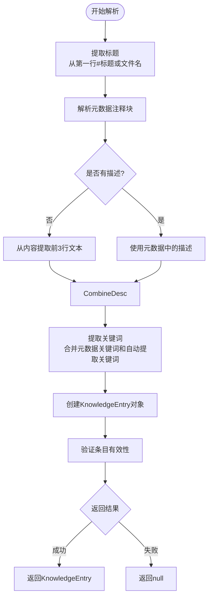

# 操作规程

<cite>
**本文档引用的文件**
- [KnowledgeBaseService.js](file://backend\src\services\KnowledgeBaseService.js)
- [KnowledgeEntry.js](file://backend\src\models\KnowledgeEntry.js)
- [cpu-high-usage.md](file://knowledge-base\operation-procedures\cpu-high-usage.md)
- [memory-shortage.md](file://knowledge-base\operation-procedures\memory-shortage.md)
- [network-issues.md](file://knowledge-base\operation-procedures\network-issues.md)
</cite>

## 目录
1. [系统概述](#系统概述)
2. [操作规程文档结构](#操作规程文档结构)
3. [元数据配置与作用](#元数据配置与作用)
4. [新增或修改操作规程步骤](#新增或修改操作规程步骤)
5. [解析方法实现原理](#解析方法实现原理)

## 系统概述

智能运维助手系统通过`KnowledgeBaseService`服务加载和解析位于`operation-procedures`目录下的Markdown格式操作规程文件。该服务在初始化时会自动扫描知识库路径下的运维处置文档，并将其转换为结构化的`KnowledgeEntry`对象存储在内存中，供后续搜索、推荐和使用。

系统采用模块化设计，核心组件包括：
- **KnowledgeBaseService**: 负责知识库的加载、解析和管理
- **KnowledgeEntry**: 表示单个知识条目的数据模型
- **operation-procedures目录**: 存放所有运维问题的标准处理流程文档

当系统启动时，`KnowledgeBaseService`会调用`initialize()`方法，该方法首先设置默认的知识库路径（指向项目根目录下的`knowledge-base`文件夹），然后执行`loadKnowledgeBase()`来加载所有知识文档。

**Section sources**
- [KnowledgeBaseService.js](file://backend\src\services\KnowledgeBaseService.js#L14-L577)

## 操作规程文档结构

每个运维问题的操作规程文档都遵循统一的Markdown结构，确保信息的一致性和可解析性。以CPU高使用率、内存不足、网络异常等常见问题为例，其标准文档结构包含以下几个关键部分：

### 标题
文档必须以一级标题（`#`）开始，定义该操作规程的主题。例如：
```markdown
# 服务器高CPU使用率问题处置
```

### 元数据注释块
紧跟标题之后是一个特殊的HTML注释块，用于存放结构化元数据：
```markdown
<!-- metadata
{
  "category": "performance",
  "keywords": ["CPU", "高使用率", "性能", "服务器"],
  "description": "服务器CPU使用率过高的诊断和处置方法"
}
-->
```

### 问题现象
描述该问题的具体表现和可能的影响，帮助用户识别问题。例如CPU高使用率可能导致系统响应缓慢、应用程序性能下降等。

### 处置步骤
详细列出解决问题的具体操作步骤，通常分为多个子步骤，使用二级或三级标题组织。每个步骤应清晰明确，包含必要的命令行示例。

### 预期结果
说明按照规程操作后应该达到的效果，以及如何验证问题是否已解决。

### 注意事项
列出操作过程中需要特别注意的事项，如业务影响评估、数据备份要求等。

### 相关工具
列举可用于诊断和解决问题的相关工具和命令。

**Section sources**
- [cpu-high-usage.md](file://knowledge-base\operation-procedures\cpu-high-usage.md#L1-L96)
- [memory-shortage.md](file://knowledge-base\operation-procedures\memory-shortage.md#L1-L166)
- [network-issues.md](file://knowledge-base\operation-procedures\network-issues.md#L1-L269)

## 元数据配置与作用

元数据注释块中的配置项在系统的搜索与推荐功能中起着至关重要的作用。这些配置不仅提供了文档的附加信息，还直接影响了知识条目的检索效率和准确性。

### category（分类）
表示该操作规程所属的类别，如"performance"（性能）、"network"（网络）等。分类信息用于：
- 快速过滤特定类型的问题
- 在推荐系统中基于问题分类进行匹配
- 统计分析各类问题的分布情况

### keywords（关键词）
一个字符串数组，包含与该文档相关的关键词。关键词的作用包括：
- 提升搜索匹配度：当用户搜索包含这些关键词的内容时，相关文档会被优先返回
- 增强语义理解：帮助系统更好地理解文档的主题和内容
- 支持模糊搜索：即使用户的查询不完全匹配标题，也能找到相关内容

### description（描述）
对文档内容的简要概括，主要用途有：
- 当没有提供显式描述时，作为搜索摘要的基础
- 在搜索结果列表中显示预览信息
- 辅助关键词提取算法生成更多相关关键词

如果文档中未提供描述，系统会自动从内容中提取前几行非标题文本作为描述。

```mermaid
classDiagram
class KnowledgeEntry {
+string knowledge_id
+string knowledge_type
+string title
+string content
+string[] keywords
+string? category
+Record~string, any~ metadata
+validate() ValidationResult
+matchesSearch(query) MatchResult
+createSearchSummary(query) string
}
class KnowledgeBaseService {
+Map~string, KnowledgeEntry~ knowledgeEntries
+Set~string~ categories
+Set~string~ keywords
+boolean initialized
+string knowledgeBasePath
+initialize(path) Promise~void~
+loadOperationProcedures() Promise~void~
+parseOperationProcedure(content, filename) KnowledgeEntry
+search(query, options) SearchResult
+getRecommendations(category) KnowledgeEntry[]
}
KnowledgeBaseService --> KnowledgeEntry : "创建并管理"
KnowledgeBaseService ..> "operation-procedures/" : "读取Markdown文件"
```

**Diagram sources**
- [KnowledgeBaseService.js](file://backend\src\services\KnowledgeBaseService.js#L14-L577)
- [KnowledgeEntry.js](file://backend\src\models\KnowledgeEntry.js#L7-L251)

**Section sources**
- [KnowledgeBaseService.js](file://backend\src\services\KnowledgeBaseService.js#L110-L173)
- [KnowledgeEntry.js](file://backend\src\models\KnowledgeEntry.js#L7-L251)

## 新增或修改操作规程步骤

添加新的操作规程或修改现有规程的流程如下：

### 新增操作规程
1. 在`knowledge-base/operation-procedures/`目录下创建一个新的`.md`文件
2. 使用标准模板编写内容：
   - 以`#`开头的一级标题
   - 添加元数据注释块，正确配置category、keywords和description
   - 按照标准结构编写问题现象、处置步骤等内容
3. 保存文件

### 修改现有规程
1. 找到对应的`.md`文件
2. 编辑需要修改的部分
3. 可选择性更新元数据中的keywords或description字段以反映变更
4. 保存文件

### 重新加载知识库
完成新增或修改后，需要通知系统重新加载知识库。可以通过以下方式之一实现：
- 调用`KnowledgeBaseService.reload()`方法
- 发送HTTP POST请求到`/api/knowledge/reload`端点
- 重启应用服务

系统会在下次搜索或推荐时自动使用更新后的知识库内容。

**Section sources**
- [KnowledgeBaseService.js](file://backend\src\services\KnowledgeBaseService.js#L532-L582)
- [cpu-high-usage.md](file://knowledge-base\operation-procedures\cpu-high-usage.md#L1-L96)

## 解析方法实现原理

`parseOperationProcedure`方法是整个知识库加载过程的核心，负责将原始的Markdown文件内容转换为结构化的`KnowledgeEntry`对象。其实现逻辑如下：

### 输入参数
- `content`: Markdown文件的完整文本内容
- `filename`: 文件名，用于提取默认标题

### 处理流程
1. **标题提取**：遍历每一行文本，查找以`# `开头的行作为文档标题。如果没有找到，则使用文件名（去除.md扩展名）作为默认标题。

2. **元数据解析**：使用正则表达式`/<!--\\s*metadata\\s*(.*?)\\s*-->/s`匹配元数据注释块，并尝试将其内容解析为JSON对象。成功解析后，提取category、keywords和description字段。

3. **描述生成**：如果元数据中未提供description，则从内容中提取前三个有意义的文本行（非空、非标题、非注释行）作为描述。

4. **关键词提取**：结合元数据中的keywords和通过`extractKeywords()`方法自动生成的关键词。自动生成基于标题和描述的文本分析，去除停用词后统计词频，选取出现频率最高的前10个词。

5. **构建KnowledgeEntry**：使用收集到的所有信息创建`KnowledgeEntry`实例，其中：
   - `knowledge_type`固定为'operation-procedure'
   - `source_file`记录原始文件名
   - `metadata`中额外存储描述、文件大小和行数等信息

6. **返回结果**：返回构建好的`KnowledgeEntry`对象，若解析过程中发生错误则返回null。



**Diagram sources**
- [KnowledgeBaseService.js](file://backend\src\services\KnowledgeBaseService.js#L110-L173)
- [KnowledgeEntry.js](file://backend\src\models\KnowledgeEntry.js#L7-L251)

**Section sources**
- [KnowledgeBaseService.js](file://backend\src\services\KnowledgeBaseService.js#L110-L173)
- [KnowledgeEntry.js](file://backend\src\models\KnowledgeEntry.js#L7-L251)