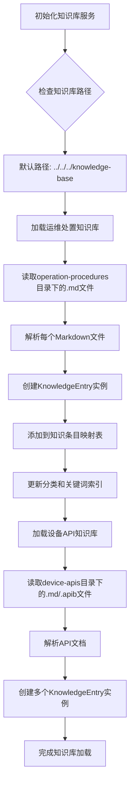
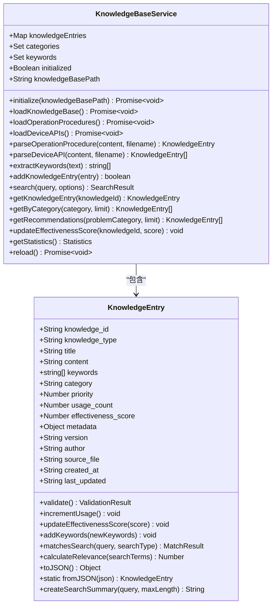
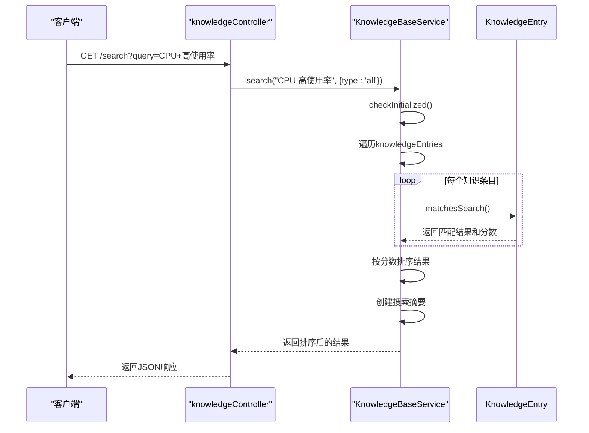

# 知识库管理

<cite>
**本文档引用文件**  
- [KnowledgeBaseService.js](file://backend/src/services/KnowledgeBaseService.js)
- [KnowledgeEntry.js](file://backend/src/models/KnowledgeEntry.js)
- [knowledgeController.js](file://backend/src/controllers/knowledgeController.js)
- [cpu-high-usage.md](file://knowledge-base/operation-procedures/cpu-high-usage.md)
- [database-management-api.md](file://knowledge-base/device-apis/database-management-api.md)
</cite>

## 目录
1. [知识内容分类](#知识内容分类)  
2. [知识条目标准格式](#知识条目标准格式)  
3. [知识库服务工作机制](#知识库服务工作机制)  
4. [新增与更新知识条目指南](#新增与更新知识条目指南)  
5. [保持知识时效性最佳实践](#保持知识时效性最佳实践)

## 知识内容分类

系统通过Markdown文件构建运维知识体系，主要分为两类知识内容：

### 操作规程类知识
存放于`knowledge-base/operation-procedures/`目录下，包含常见运维问题的处置流程。例如：
- `cpu-high-usage.md`：服务器高CPU使用率问题处置
- `memory-shortage.md`：内存不足问题处理
- `network-issues.md`：网络故障排查方法

此类知识文档以问题现象为切入点，提供详细的诊断步骤和解决方案。

### 设备API接口文档
存放于`knowledge-base/device-apis/`目录下，记录各类设备操作API的使用方法。例如：
- `database-management-api.md`：数据库管理API接口说明
- `server-monitoring-api.md`：服务器监控API接口说明

此类文档详细描述了API的URL、请求方法、参数说明、请求示例和响应格式等信息。

**Section sources**
- [cpu-high-usage.md](file://knowledge-base/operation-procedures/cpu-high-usage.md)
- [database-management-api.md](file://knowledge-base/device-apis/database-management-api.md)

## 知识条目标准格式

所有知识条目需遵循统一的格式规范，确保信息完整性和检索效率。

### 基本字段要求
根据`KnowledgeEntry`模型定义，每个知识条目必须包含以下核心字段：
- **knowledge_id**: 唯一标识符（自动生成）
- **knowledge_type**: 知识类型（operation-procedure或device-api）
- **title**: 标题（必填）
- **content**: 内容正文（必填）
- **keywords**: 关键词列表
- **category**: 分类标签
- **priority**: 优先级（0-10）
- **effectiveness_score**: 有效性评分（0-1）

**Section sources**
- [KnowledgeEntry.js](file://backend/src/models/KnowledgeEntry.js#L7-L251)

### Markdown文档结构规范

#### 操作规程文档结构
```markdown
# 问题标题

<!-- metadata
{
  "category": "分类",
  "keywords": ["关键词1", "关键词2"],
  "description": "简要描述"
}
-->

## 问题现象
描述问题的具体表现

## 处置步骤
分步说明解决方法

## 注意事项
提醒重要事项

## 相关工具
列出相关命令或工具
```

#### API接口文档结构
```markdown
# API名称

## 接口名称
### HTTP方法 URL路径

**Description:** 接口功能描述

**Parameters:**
| 参数名 | 类型 | 是否必需 | 描述 |
|--------|------|----------|------|

**Request Example:**
```bash
curl示例
```

**Response Example:**
```json
响应示例
```
```

**Section sources**
- [cpu-high-usage.md](file://knowledge-base/operation-procedures/cpu-high-usage.md)
- [database-management-api.md](file://knowledge-base/device-apis/database-management-api.md)

## 知识库服务工作机制

`KnowledgeBaseService`负责扫描目录、解析Markdown元数据并建立索引供快速检索。

### 目录扫描与加载流程


**Diagram sources**
- [KnowledgeBaseService.js](file://backend/src/services/KnowledgeBaseService.js#L14-L577)

### 元数据解析机制
服务会自动解析Markdown文件中的元数据注释块：
```markdown
<!-- metadata
{
  "category": "performance",
  "keywords": ["CPU", "高使用率", "性能"],
  "description": "服务器CPU使用率过高的诊断和处置方法"
}
-->
```

若未提供元数据，系统将自动提取标题作为主标题，并从内容中抽取前几行作为描述。

### 索引建立与检索
服务在内存中维护三个主要索引结构：
- **knowledgeEntries**: Map结构，以knowledge_id为键存储完整知识条目
- **categories**: Set结构，存储所有出现过的分类
- **keywords**: Set结构，存储所有关键词

搜索时采用多维度匹配算法，综合考虑标题、关键词、内容和分类的匹配度，并结合优先级和有效性评分进行加权计算。



**Diagram sources**
- [KnowledgeBaseService.js](file://backend/src/services/KnowledgeBaseService.js#L14-L577)
- [KnowledgeEntry.js](file://backend/src/models/KnowledgeEntry.js#L7-L251)

### 搜索流程


**Diagram sources**
- [knowledgeController.js](file://backend/src/controllers/knowledgeController.js#L1-L166)
- [KnowledgeBaseService.js](file://backend/src/services/KnowledgeBaseService.js#L14-L577)

**Section sources**
- [KnowledgeBaseService.js](file://backend/src/services/KnowledgeBaseService.js#L14-L577)
- [KnowledgeEntry.js](file://backend/src/models/KnowledgeEntry.js#L7-L251)
- [knowledgeController.js](file://backend/src/controllers/knowledgeController.js#L1-L166)

## 新增与更新知识条目指南

### 新增知识条目步骤
1. 确定知识类型（操作规程或设备API）
2. 在对应目录创建新的Markdown文件：
   - 操作规程：`knowledge-base/operation-procedures/文件名.md`
   - 设备API：`knowledge-base/device-apis/文件名.md`
3. 按照标准格式编写内容
4. 添加元数据注释块（可选但推荐）
5. 保存文件
6. 调用重新加载接口使更改生效

### 更新现有知识条目
1. 找到对应的Markdown文件
2. 编辑内容，确保符合最新实践
3. 更新元数据中的版本信息（如有）
4. 保存文件
5. 调用重新加载接口同步变更

### 重新加载知识库
当新增或修改知识条目后，需要重新加载知识库以使变更生效：

```http
POST /knowledge/reload
Content-Type: application/json
```

此操作会清空现有索引，重新扫描目录并重建所有索引。

**Section sources**
- [KnowledgeBaseService.js](file://backend/src/services/KnowledgeBaseService.js#L532-L582)
- [knowledgeController.js](file://backend/src/controllers/knowledgeController.js#L147-L166)

## 保持知识时效性最佳实践

### 定期审查机制
建立定期的知识条目审查制度：
- 每季度对所有知识条目进行一次全面审查
- 重点关注高使用频率的知识条目
- 标记过时或需要验证的内容

### 有效性评分反馈
系统支持用户对知识条目的有效性进行评分（0-1之间），该评分会影响搜索排名：
- 成功解决问题：评分接近1.0
- 部分有效：评分0.5左右
- 无效或错误：评分接近0.0

```javascript
// 更新有效性评分示例
await knowledgeBaseService.updateEffectivenessScore('knowledge-id', 0.9);
```

### 使用统计跟踪
系统自动记录每个知识条目的使用情况：
- **usage_count**: 使用次数，每次获取详情时递增
- **last_updated**: 最后更新时间
- 统计信息可用于识别热门和冷门知识条目

### 版本控制建议
虽然系统本身不直接管理版本，但建议在知识条目中包含版本信息：
```json
{
  "version": "1.2.0",
  "author": "张三",
  "created_at": "2024-01-15",
  "last_updated": "2024-06-20"
}
```

### 自动化测试集成
将关键知识条目纳入自动化测试范围：
- 对API文档进行端到端测试
- 验证操作规程的准确性
- 定期运行验证脚本确保知识有效性

### 变更通知机制
当重要知识条目被更新时：
- 通知相关团队成员
- 在系统公告中发布变更摘要
- 记录变更日志供审计

**Section sources**
- [KnowledgeBaseService.js](file://backend/src/services/KnowledgeBaseService.js#L486-L537)
- [KnowledgeEntry.js](file://backend/src/models/KnowledgeEntry.js#L7-L251)