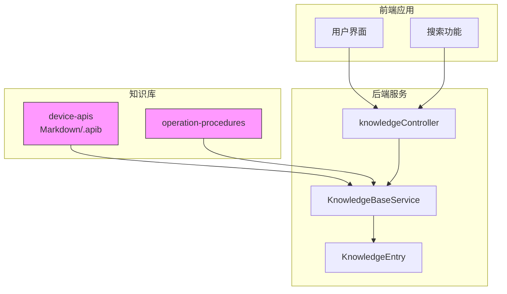
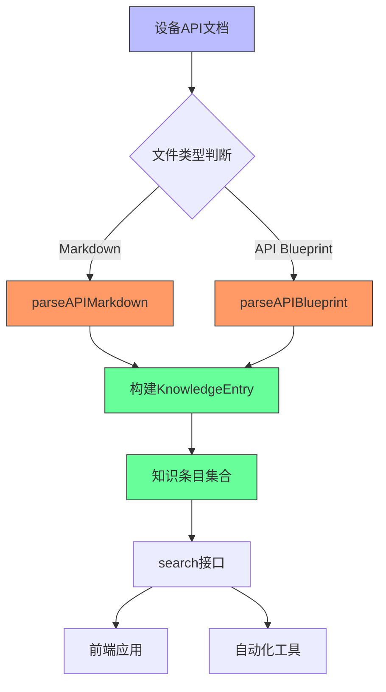
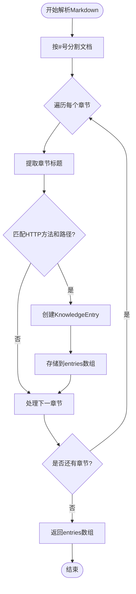
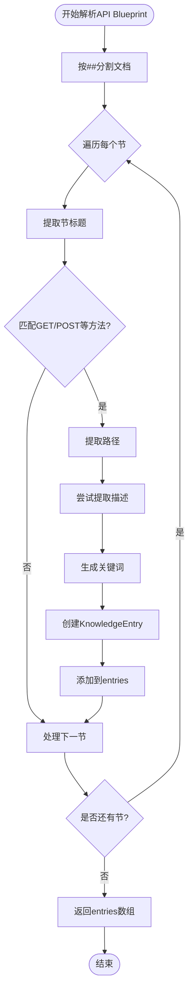
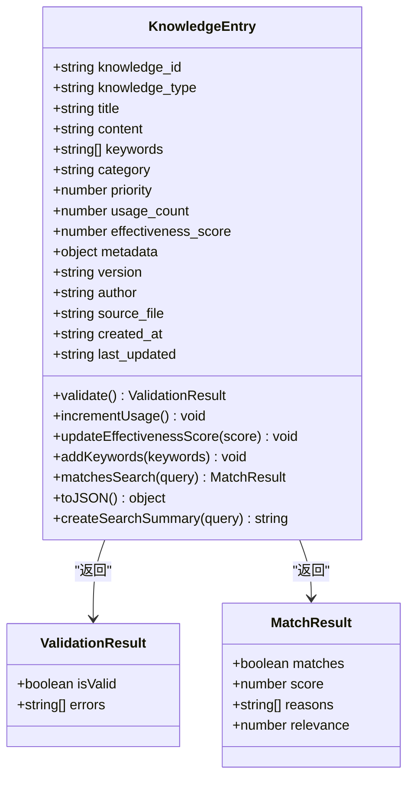
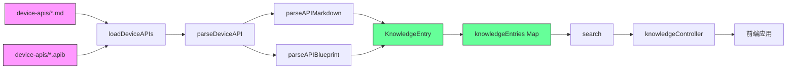

# 设备API接口

<cite>
**本文档引用文件**
- [KnowledgeBaseService.js](file://backend/src/services/KnowledgeBaseService.js)
- [KnowledgeEntry.js](file://backend/src/models/KnowledgeEntry.js)
- [database-management-api.md](file://knowledge-base/device-apis/database-management-api.md)
- [server-monitoring-api.md](file://knowledge-base/device-apis/server-monitoring-api.md)
</cite>

## 目录
1. [简介](#简介)
2. [项目结构](#项目结构)
3. [核心组件](#核心组件)
4. [架构概述](#架构概述)
5. [详细组件分析](#详细组件分析)
6. [依赖分析](#依赖分析)
7. [性能考虑](#性能考虑)
8. [故障排除指南](#故障排除指南)
9. [结论](#结论)

## 简介
本系统通过`device-apis`目录集中管理设备相关的API文档，支持Markdown和API Blueprint两种格式。系统在启动时自动加载并解析这些文档，提取关键信息构建知识库索引，实现对设备操作API的智能化检索与调用。该机制为自动化运维工具提供了标准化的知识来源，使系统能够理解并执行各类设备管理操作。

## 项目结构
系统采用前后端分离架构，后端服务负责知识库的加载、解析与检索，前端提供用户交互界面。设备API文档统一存放在`knowledge-base/device-apis`目录下，由后端服务进行解析处理。

**Diagram sources**
- [KnowledgeBaseService.js](file://backend/src/services/KnowledgeBaseService.js#L178-L202)
- [device-apis](file://knowledge-base/device-apis)

**Section sources**
- [KnowledgeBaseService.js](file://backend/src/services/KnowledgeBaseService.js#L178-L202)
- [project_structure](file://PROJECT_SUMMARY.md)

## 核心组件
系统的核心在于`KnowledgeBaseService`类中的`parseDeviceAPI`方法，它负责解析不同格式的API文档，并将解析结果封装为`KnowledgeEntry`对象存储到知识库中。整个流程包括：读取文件内容 → 判断文件类型 → 调用相应解析器 → 提取元数据 → 构建知识条目 → 建立索引。

**Section sources**
- [KnowledgeBaseService.js](file://backend/src/services/KnowledgeBaseService.js#L207-L224)
- [KnowledgeEntry.js](file://backend/src/models/KnowledgeEntry.js#L7-L251)

## 架构概述
系统采用分层架构设计，从底层文件存储到上层应用服务形成清晰的数据流。设备API文档作为原始数据源，经过解析层处理后转化为结构化知识，通过服务层对外提供检索接口，最终服务于前端应用和自动化工具。

**Diagram sources**
- [KnowledgeBaseService.js](file://backend/src/services/KnowledgeBaseService.js#L207-L224)
- [KnowledgeBaseService.js](file://backend/src/services/KnowledgeBaseService.js#L275-L311)

## 详细组件分析

### API文档解析机制
系统实现了针对不同格式API文档的解析逻辑，确保能够从多种文档格式中提取统一的结构化信息。

#### Markdown格式解析
对于Markdown格式的API文档，系统按标题分割文档内容，识别每个API端点的HTTP方法和路径信息。

**Diagram sources**
- [KnowledgeBaseService.js](file://backend/src/services/KnowledgeBaseService.js#L275-L311)

#### API Blueprint格式解析
对于API Blueprint格式的文档，系统以"## "作为分隔符拆分各个资源节，然后从中提取HTTP动作信息。

**Diagram sources**
- [KnowledgeBaseService.js](file://backend/src/services/KnowledgeBaseService.js#L229-L270)

### KnowledgeEntry知识条目模型
`KnowledgeEntry`类用于封装每一个API条目的元信息，形成标准化的知识单元。

**Diagram sources**
- [KnowledgeEntry.js](file://backend/src/models/KnowledgeEntry.js#L7-L251)

**Section sources**
- [KnowledgeEntry.js](file://backend/src/models/KnowledgeEntry.js#L7-L251)

## 依赖分析
系统各组件之间存在明确的依赖关系，形成了稳定的服务链条。

**Diagram sources**
- [KnowledgeBaseService.js](file://backend/src/services/KnowledgeBaseService.js#L178-L202)
- [KnowledgeBaseService.js](file://backend/src/services/KnowledgeBaseService.js#L207-L224)

**Section sources**
- [KnowledgeBaseService.js](file://backend/src/services/KnowledgeBaseService.js#L178-L202)

## 性能考虑
系统在设计时充分考虑了性能因素：
- 使用Map数据结构存储知识条目，保证O(1)的查找效率
- 在解析文档时进行批量处理，减少I/O操作次数
- 关键词提取算法优化，避免过度消耗CPU资源
- 搜索结果缓存机制，提高重复查询效率
- 内存中维护完整的知识库索引，避免频繁磁盘读取

尽管如此，在知识库规模较大时仍需关注内存使用情况，建议定期监控系统资源消耗。

## 故障排除指南
当遇到API文档无法正确解析或检索不到的问题时，可按照以下步骤排查：

1. **检查文件位置**：确认API文档位于`knowledge-base/device-apis`目录下
2. **验证文件扩展名**：确保文件以`.md`或`.apib`结尾
3. **检查文件编码**：文档必须为UTF-8编码
4. **查看日志信息**：检查服务启动日志中是否有"加载设备API文档失败"的相关记录
5. **验证文档格式**：确保文档中包含正确的HTTP方法标识（如GET、POST等）
6. **测试搜索关键词**：尝试使用文档中的标题、路径或参数名称作为搜索词

常见问题及解决方案：
- 文档未被加载：检查目录路径配置和文件权限
- 搜索无结果：确认搜索关键词是否存在于标题、内容或自动生成的关键词中
- 解析错误：检查正则表达式匹配模式是否适应文档格式变化

**Section sources**
- [KnowledgeBaseService.js](file://backend/src/services/KnowledgeBaseService.js#L178-L202)
- [KnowledgeBaseService.js](file://backend/src/services/KnowledgeBaseService.js#L207-L224)

## 结论
本系统通过统一的机制管理设备API文档，实现了从非结构化文档到结构化知识的转化。`parseDeviceAPI`方法灵活支持多种文档格式，`KnowledgeEntry`模型则提供了丰富的元数据描述能力。