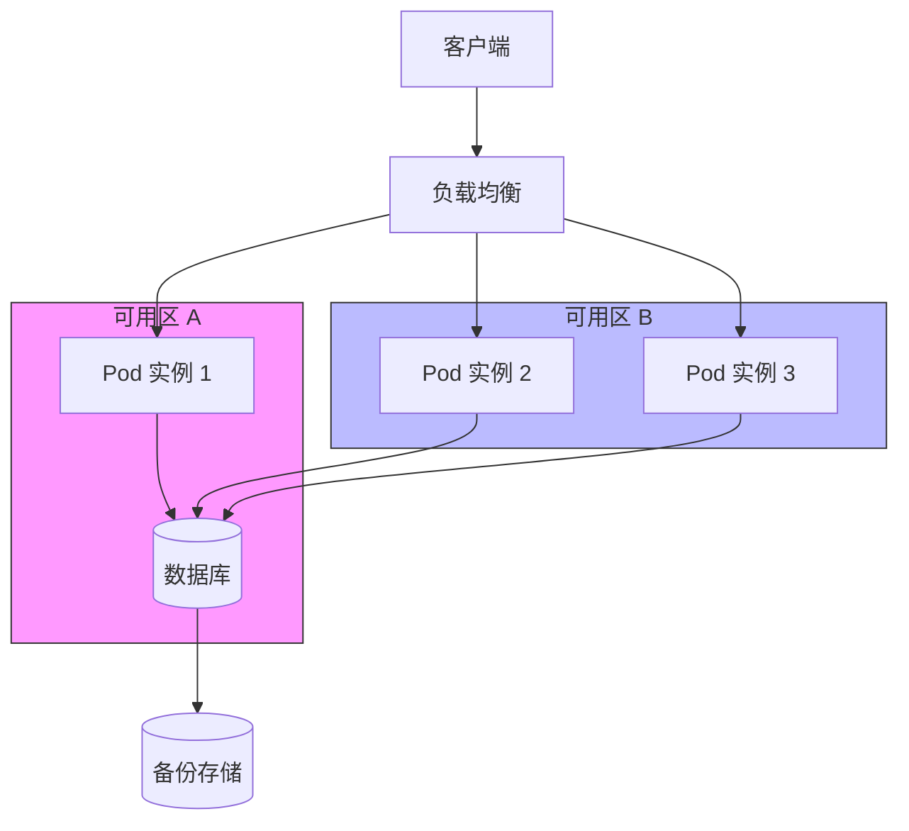

# 云平台部署

<cite>
**本文档引用的文件**  
- [app-config.json](file://configs/app-config.json)
- [llm-config.json](file://configs/llm-config.json)
- [README.md](file://README.md)
- [PROJECT_SUMMARY.md](file://PROJECT_SUMMARY.md)
</cite>

## 目录
1. [引言](#引言)
2. [主流云服务商部署建议](#主流云服务商部署建议)
3. [云服务器部署指南](#云服务器部署指南)
4. [Kubernetes 部署方案](#kubernetes-部署方案)
5. [高可用架构设计](#高可用架构设计)
6. [云原生存储方案](#云原生存储方案)
7. [监控告警集成](#监控告警集成)
8. [CI/CD 流水线对接](#cicd-流水线对接)
9. [成本优化建议](#成本优化建议)
10. [灾备恢复方案](#灾备恢复方案)

## 引言

智能运维助手（AutoOperation）是一个基于大语言模型的智能化运维处置系统，支持前后端分离架构，具备渐进式问题诊断、自动化执行和知识库驱动等核心功能。本指南旨在为在主流云平台（如 AWS、阿里云、腾讯云）上部署该系统提供全面的技术指导，涵盖从实例选型到高可用架构设计的完整流程。

**文档来源**
- [README.md](file://README.md#L1-L130)
- [PROJECT_SUMMARY.md](file://PROJECT_SUMMARY.md#L1-L145)

## 主流云服务商部署建议

### AWS 部署建议
- **EC2 实例类型**：推荐使用 `t3.large` 或 `m5.xlarge`，适用于中等负载场景；若需更高性能可选用 `c5.2xlarge`
- **区域选择**：建议选择靠近用户群体的区域，如 `ap-southeast-1`（新加坡）
- **VPC 配置**：创建独立 VPC，划分子网（公有子网用于前端访问，私有子网用于后端服务）
- **安全组设置**：
  - 允许 80 和 443 端口入站（前端）
  - 允许 3000 端口入站（后端 API）
  - 出站规则开放所有流量

### 阿里云部署建议
- **ECS 实例类型**：推荐 `ecs.g7.large` 或 `ecs.c7.xlarge`，平衡计算与内存资源
- **网络配置**：使用专有网络 VPC，配置 NAT 网关实现内网访问公网
- **安全组策略**：
  - 开放 80、443 端口给 0.0.0.0/0
  - 限制 3000 端口仅允许来自前端服务器或负载均衡器的访问
- **SLB 集成**：建议搭配应用型负载均衡 SLB 实现流量分发

### 腾讯云部署建议
- **CVM 实例类型**：推荐 `S5.LARGE8` 或 `SA2.MEDIUM8`
- **私有网络**：创建独立私有网络，划分业务子网
- **安全组规则**：
  - 前端服务器：开放 HTTP/HTTPS
  - 后端服务器：仅允许来自负载均衡或前端的 3000 端口访问
- **CLB 配置**：使用传统型负载均衡 CLB 进行流量调度

**Section sources**
- [README.md](file://README.md#L1-L130)
- [PROJECT_SUMMARY.md](file://PROJECT_SUMMARY.md#L1-L145)

## 云服务器部署指南

### 实例选型建议
| 场景 | 推荐配置 | 说明 |
|------|----------|------|
| 开发测试 | 2核4G | 满足基本运行需求 |
| 生产环境（轻量） | 4核8G | 支持并发会话处理 |
| 生产环境（标准） | 8核16G | 支持高并发及复杂分析任务 |

### 网络配置
- **IP 分配**：使用弹性公网 IP 绑定前端服务器
- **DNS 解析**：通过云解析服务绑定自定义域名
- **反向代理**：建议使用 Nginx 或云原生负载均衡进行请求转发

### 安全组设置
```json
{
  "IngressRules": [
    {
      "Protocol": "TCP",
      "PortRange": "80",
      "SourceCIDR": "0.0.0.0/0",
      "Description": "HTTP 访问"
    },
    {
      "Protocol": "TCP",
      "PortRange": "443",
      "SourceCIDR": "0.0.0.0/0",
      "Description": "HTTPS 访问"
    },
    {
      "Protocol": "TCP",
      "PortRange": "3000",
      "SourceCIDR": "10.0.0.0/16",
      "Description": "后端API访问（仅内网）"
    }
  ]
}
```

**Section sources**
- [app-config.json](file://configs/app-config.json#L1-L40)
- [README.md](file://README.md#L1-L130)

## Kubernetes 部署方案

### Deployment 配置示例
```yaml
apiVersion: apps/v1
kind: Deployment
metadata:
  name: autooperation-backend
spec:
  replicas: 3
  selector:
    matchLabels:
      app: autooperation-backend
  template:
    metadata:
      labels:
        app: autooperation-backend
    spec:
      containers:
      - name: backend
        image: your-registry/autooperation-backend:v1.0
        ports:
        - containerPort: 3000
        env:
        - name: NODE_ENV
          value: production
        resources:
          requests:
            memory: "512Mi"
            cpu: "500m"
          limits:
            memory: "1Gi"
            cpu: "1000m"
```

### Service 配置示例
```yaml
apiVersion: v1
kind: Service
metadata:
  name: autooperation-backend-service
spec:
  selector:
    app: autooperation-backend
  ports:
    - protocol: TCP
      port: 80
      targetPort: 3000
  type: ClusterIP
```

### Ingress 配置示例
```yaml
apiVersion: networking.k8s.io/v1
kind: Ingress
metadata:
  name: autooperation-ingress
  annotations:
    nginx.ingress.kubernetes.io/ssl-redirect: "true"
    nginx.ingress.kubernetes.io/proxy-body-size: "10m"
spec:
  ingressClassName: nginx
  rules:
  - host: ops.yourcompany.com
    http:
      paths:
      - path: /api/v1
        pathType: Prefix
        backend:
          service:
            name: autooperation-backend-service
            port:
              number: 80
  tls:
  - hosts:
    - ops.yourcompany.com
    secretName: ops-tls-secret
```

**Section sources**
- [app-config.json](file://configs/app-config.json#L1-L40)
- [llm-config.json](file://configs/llm-config.json#L1-L69)

## 高可用架构设计

### 负载均衡
- 使用云服务商提供的负载均衡器（如 AWS ALB、阿里云 SLB）进行流量分发
- 后端服务部署多个副本，通过 Service 实现负载均衡

### 自动伸缩
```yaml
apiVersion: autoscaling/v2
kind: HorizontalPodAutoscaler
metadata:
  name: backend-hpa
spec:
  scaleTargetRef:
    apiVersion: apps/v1
    kind: Deployment
    name: autooperation-backend
  minReplicas: 2
  maxReplicas: 10
  metrics:
  - type: Resource
    resource:
      name: cpu
      target:
        type: Utilization
        averageUtilization: 70
```

### 故障转移机制
- 多可用区部署：确保实例分布在不同物理区域
- 健康检查：配置 Liveness 和 Readiness 探针
- 会话持久化：通过 Redis 或数据库实现会话状态共享

**Diagram sources**
- [app-config.json](file://configs/app-config.json#L1-L40)



**Section sources**
- [PROJECT_SUMMARY.md](file://PROJECT_SUMMARY.md#L1-L145)
- [app-config.json](file://configs/app-config.json#L1-L40)

## 云原生存储方案

### 存储需求分析
- **会话数据**：短期存储，TTL 可设为 24 小时
- **知识库文件**：静态内容，适合对象存储
- **日志文件**：需定期归档和分析

### 推荐方案
| 数据类型 | 推荐存储 | 说明 |
|---------|----------|------|
| 会话状态 | Redis 缓存 | 支持 TTL 和快速读写 |
| 知识库文档 | 对象存储（S3/OSS/COS） | 成本低，支持 CDN 加速 |
| 日志文件 | 云日志服务（CloudWatch/SLS/CLS） | 支持结构化查询和告警 |
| 配置文件 | 配置中心（SSM/ACM/CMQ） | 支持动态更新和版本管理 |

**Section sources**
- [configs/app-config.json](file://configs/app-config.json#L1-L40)
- [knowledge-base](file://knowledge-base)

## 监控告警集成

### 核心监控指标
- **API 响应时间**：P95 < 1s
- **错误率**：5xx 错误占比 < 1%
- **LLM 调用延迟**：平均 < 5s
- **会话并发数**：实时监控活跃会话

### 告警规则建议
| 指标 | 阈值 | 动作 |
|------|------|------|
| CPU 使用率 | >80% 持续5分钟 | 发送企业微信告警 |
| 内存使用率 | >85% | 触发自动扩容 |
| API 错误率 | >5% 持续2分钟 | 通知值班工程师 |
| LLM 超时 | 单次 >30s | 记录并重试 |

**Section sources**
- [app-config.json](file://configs/app-config.json#L1-L40)
- [PROJECT_SUMMARY.md](file://PROJECT_SUMMARY.md#L1-L145)

## CI/CD 流水线对接

### 推荐流水线结构


### 关键步骤说明
- **测试阶段**：运行前端和后端单元测试
- **镜像构建**：使用 Dockerfile 构建轻量镜像
- **蓝绿部署**：减少上线对用户影响
- **回滚机制**：保留最近3个版本，支持一键回滚

**Section sources**
- [README.md](file://README.md#L1-L130)
- [PROJECT_SUMMARY.md](file://PROJECT_SUMMARY.md#L1-L145)

## 成本优化建议

### 实例优化
- 使用预留实例或包年包月降低长期成本
- 开发环境使用抢占式实例（Spot Instance）

### 存储优化
- 知识库存储启用生命周期策略，30天后转低频访问
- 日志数据定期归档至冷存储

### 架构优化
- 前后端分离部署，按需扩缩容
- 使用 CDN 加速静态资源访问

## 灾备恢复方案

### 数据备份策略
- **知识库**：每日全量备份至异地对象存储
- **会话数据**：每小时增量同步至备用区域
- **配置文件**：Git 版本控制 + 云配置中心双备份

### 故障恢复流程
1. 检测主区域服务中断
2. 切换 DNS 至备用区域
3. 启动备用环境服务
4. 恢复最新备份数据
5. 验证系统功能完整性

**Section sources**
- [PROJECT_SUMMARY.md](file://PROJECT_SUMMARY.md#L1-L145)
- [configs/app-config.json](file://configs/app-config.json#L1-L40)