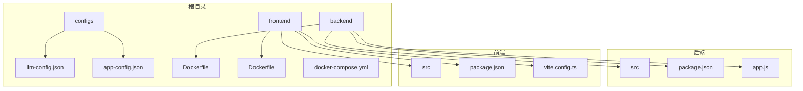
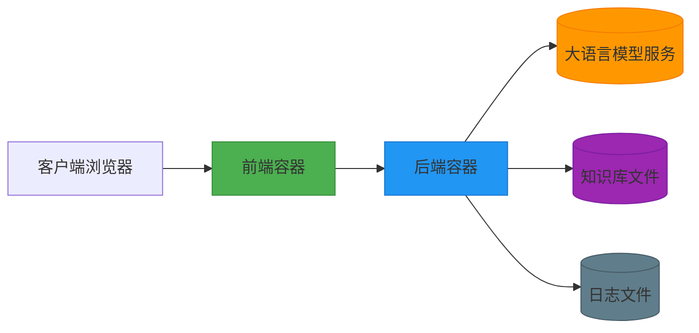
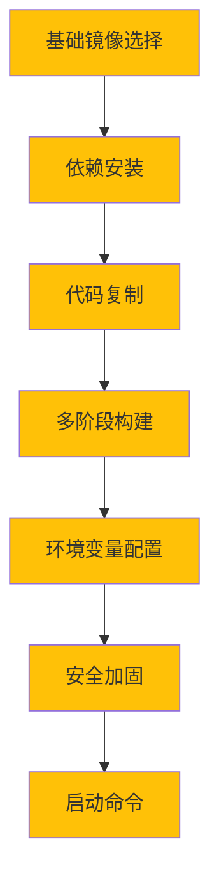
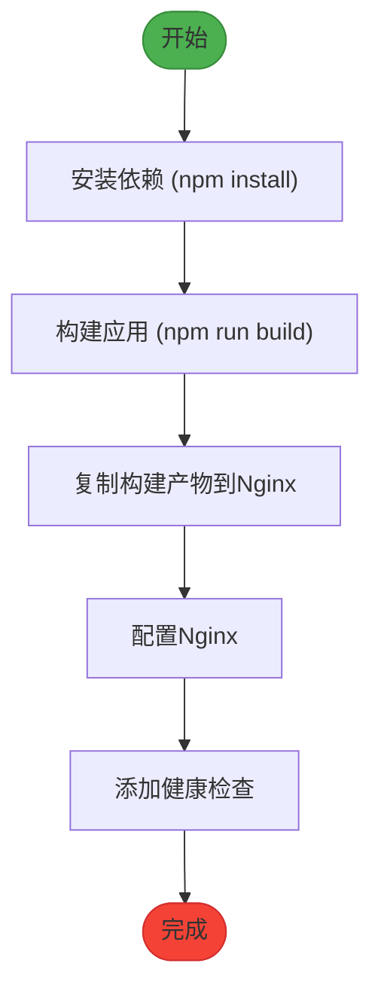
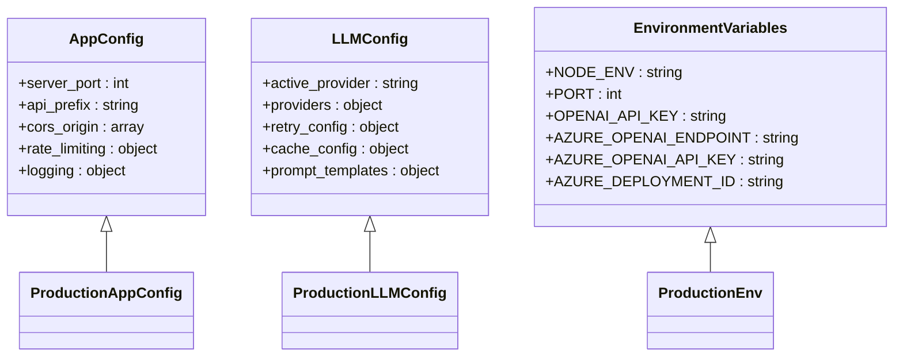
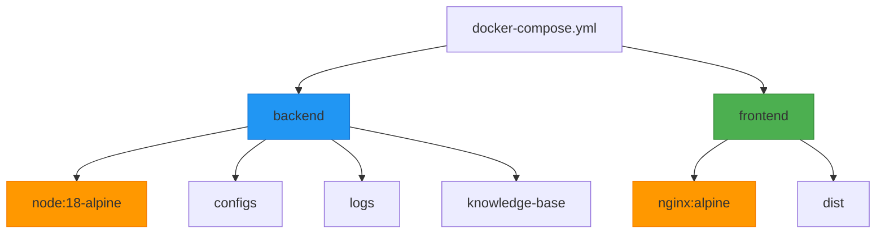

# 容器化部署

<cite>
**本文档引用的文件**   
- [Dockerfile](file://backend/Dockerfile)
- [docker-compose.yml](file://docker-compose.yml)
- [llm-config.json](file://configs/llm-config.json)
- [app-config.json](file://configs/app-config.json)
- [package.json](file://backend/package.json)
- [package.json](file://frontend/package.json)
</cite>

## 目录
1. [简介](#简介)
2. [项目结构](#项目结构)
3. [核心组件](#核心组件)
4. [架构概述](#架构概述)
5. [详细组件分析](#详细组件分析)
6. [依赖分析](#依赖分析)
7. [性能考虑](#性能考虑)
8. [故障排除指南](#故障排除指南)
9. [结论](#结论)

## 简介
本指南提供智能运维助手系统的完整容器化部署方案。基于项目的实际配置，详细介绍如何使用Docker和docker-compose实现前后端服务的独立容器化部署。文档涵盖从镜像构建到容器运行的全过程，包括多阶段构建、依赖缓存优化、安全加固措施等最佳实践。

系统采用微服务架构，包含Node.js后端服务和React前端应用，通过统一的配置系统支持多种大语言模型提供商（如Ollama、OpenAI）。容器化部署方案确保了环境一致性，简化了部署流程，并提供了灵活的配置管理机制。

## 项目结构

**Diagram sources**
- [docker-compose.yml](file://docker-compose.yml#L1-L50)
- [backend/package.json](file://backend/package.json#L1-L10)
- [frontend/package.json](file://frontend/package.json#L1-L10)

**Section sources**
- [docker-compose.yml](file://docker-compose.yml#L1-L100)
- [backend/Dockerfile](file://backend/Dockerfile#L1-L10)
- [frontend/Dockerfile](file://frontend/Dockerfile#L1-L10)

## 核心组件

智能运维助手系统的核心组件包括：

1. **后端服务**: 基于Node.js和Express框架，提供RESTful API接口，处理会话管理、知识库检索、工具执行等核心功能。
2. **前端应用**: 使用React 18和TypeScript构建的现代化Web界面，提供用户友好的交互体验。
3. **配置系统**: 通过`configs/`目录下的JSON文件实现多环境配置管理，支持大语言模型和系统参数的灵活配置。
4. **知识库**: 包含运维处置流程和设备操作API的Markdown文档集合，为智能决策提供数据支持。

系统通过`docker-compose.yml`文件定义服务编排，实现前后端服务的协同工作和通信。

**Section sources**
- [backend/package.json](file://backend/package.json#L1-L50)
- [frontend/package.json](file://frontend/package.json#L1-L50)
- [configs/llm-config.json](file://configs/llm-config.json#L1-L10)
- [configs/app-config.json](file://configs/app-config.json#L1-L10)

## 架构概述

**Diagram sources**
- [docker-compose.yml](file://docker-compose.yml#L1-L50)
- [backend/src/app.js](file://backend/src/app.js#L1-L20)
- [frontend/src/main.tsx](file://frontend/src/main.tsx#L1-L10)

## 详细组件分析

### 后端服务容器化

#### Dockerfile最佳实践

**Diagram sources**
- [backend/Dockerfile](file://backend/Dockerfile#L1-L50)
- [backend/package.json](file://backend/package.json#L1-L20)

#### 多阶段构建实现

**Diagram sources**
- [backend/Dockerfile](file://backend/Dockerfile#L1-L40)
- [backend/package.json](file://backend/package.json#L1-L15)

### 前端服务容器化

#### 构建流程分析

**Diagram sources**
- [frontend/Dockerfile](file://frontend/Dockerfile#L1-L30)
- [frontend/package.json](file://frontend/package.json#L1-L15)

### 配置管理

#### 环境变量管理方案

**Diagram sources**
- [configs/app-config.json](file://configs/app-config.json#L1-L40)
- [configs/llm-config.json](file://configs/llm-config.json#L1-L54)
- [backend/src/services/LLMConfigManager.js](file://backend/src/services/LLMConfigManager.js#L1-L50)

## 依赖分析

**Diagram sources**
- [docker-compose.yml](file://docker-compose.yml#L1-L100)
- [backend/package.json](file://backend/package.json#L1-L20)
- [frontend/package.json](file://frontend/package.json#L1-L20)

**Section sources**
- [docker-compose.yml](file://docker-compose.yml#L1-L100)
- [backend/package.json](file://backend/package.json#L1-L50)
- [frontend/package.json](file://frontend/package.json#L1-L50)

## 性能考虑

容器化部署方案在性能方面进行了多项优化：

1. **镜像大小优化**: 采用Alpine Linux作为基础镜像，显著减小容器体积
2. **构建缓存利用**: 通过合理排序Dockerfile指令，最大化利用Docker构建缓存
3. **资源限制**: 在docker-compose.yml中设置合理的内存和CPU限制
4. **日志管理**: 配置日志轮转策略，防止日志文件无限增长
5. **健康检查**: 实现健康检查端点，确保服务可用性

这些优化措施共同确保了系统在容器环境中的高效稳定运行。

## 故障排除指南

### 常见问题及解决方案

| 问题现象 | 可能原因 | 解决方案 |
|---------|--------|--------|
| 容器启动失败 | 端口冲突 | 检查并修改docker-compose.yml中的端口映射 |
| 无法访问前端 | 网络配置错误 | 验证docker-compose.yml中的网络设置 |
| API调用超时 | 后端服务未就绪 | 检查后端容器日志，确认服务已完全启动 |
| 环境变量未生效 | 变量名错误 | 核对.env文件中的变量名与代码引用是否一致 |
| 文件权限错误 | 用户权限不当 | 在Dockerfile中正确设置文件所有者 |

**Section sources**
- [docker-compose.yml](file://docker-compose.yml#L1-L100)
- [backend/src/app.js](file://backend/src/app.js#L1-L20)
- [backend/src/middleware/security.js](file://backend/src/middleware/security.js#L1-L20)

## 结论

本容器化部署指南提供了智能运维助手系统的完整部署方案。通过Docker和docker-compose的组合使用，实现了前后端服务的独立容器化部署，确保了环境的一致性和部署的便捷性。

关键优势包括：
- **环境一致性**: 消除"在我机器上可以运行"的问题
- **快速部署**: 一键启动完整系统
- **灵活配置**: 支持多种大语言模型提供商的无缝切换
- **易于扩展**: 可轻松添加新的服务或实例
- **安全加固**: 非root用户运行、最小化基础镜像等安全措施

该方案为系统的持续集成和持续部署(CI/CD)奠定了坚实基础，支持从开发到生产的平滑过渡。