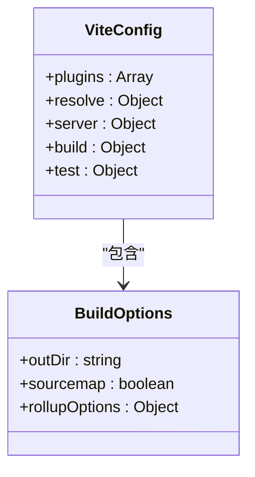
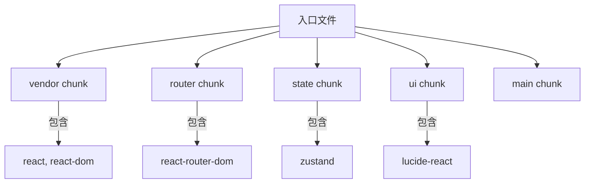
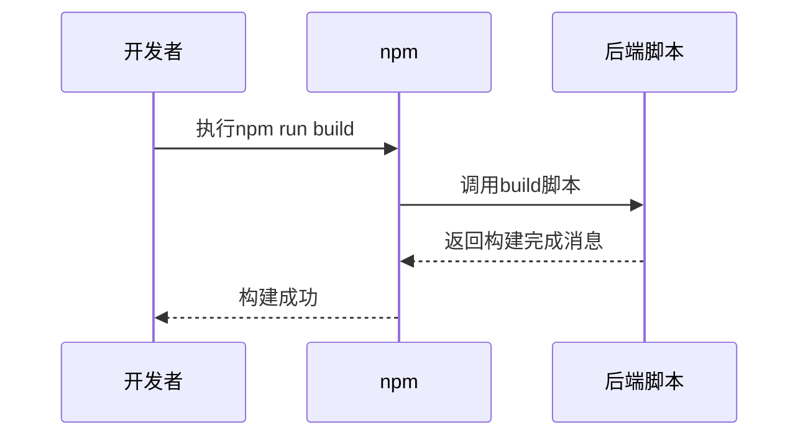
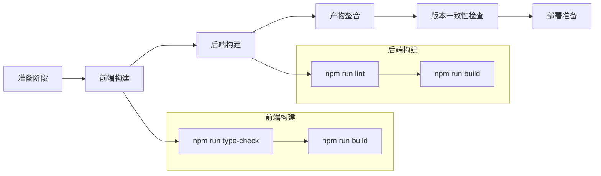
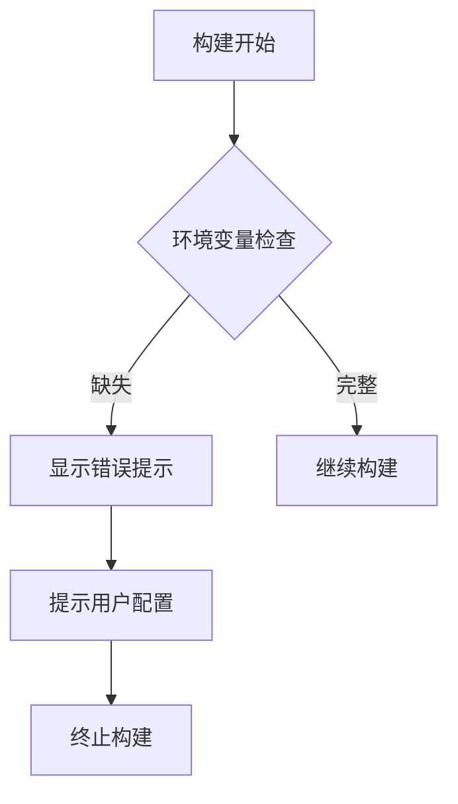
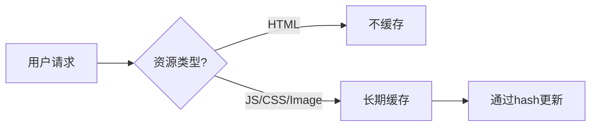

# 构建流程

<cite>
**本文档引用的文件**
- [vite.config.ts](file://frontend/vite.config.ts)
- [package.json](file://frontend/package.json)
- [package.json](file://backend/package.json)
</cite>

## 目录
1. [项目结构](#项目结构)
2. [前端构建配置](#前端构建配置)
3. [后端打包过程](#后端打包过程)
4. [完整构建流程](#完整构建流程)
5. [常见构建错误解决方案](#常见构建错误解决方案)
6. [性能优化建议](#性能优化建议)
7. [构建产物验证](#构建产物验证)

## 项目结构

AutoOperation项目采用前后端分离架构，主要包含以下目录：

- **backend**: 后端服务代码，基于Node.js + Express框架
- **frontend**: 前端应用代码，使用React + TypeScript技术栈
- **config**: 系统配置文件，支持多环境配置
- **configs**: 应用特定配置，包括LLM模型配置
- **knowledge-base**: 运维知识库文档，以Markdown格式存储
- 根目录下的package.json文件管理整体项目的脚本和依赖

这种清晰的目录结构有助于团队协作开发和维护。

**Section sources**
- [validate-system.sh](file://validate-system.sh#L0-L427)
- [simple-validate.sh](file://simple-validate.sh#L0-L120)

## 前端构建配置

前端构建由Vite驱动，其核心配置在vite.config.ts文件中定义。该配置针对生产环境进行了优化，确保生成高效、可维护的静态资源。

**Diagram sources**
- [vite.config.ts](file://frontend/vite.config.ts#L0-L42)

### 输出目录配置

构建输出目录通过`build.outDir`选项指定为"dist"，这是现代前端项目的标准做法。所有构建后的静态资源将被放置在此目录中，便于部署到Web服务器或CDN。

### 资源压缩设置

Vite默认启用多种压缩优化：
- JavaScript/CSS自动压缩
- Gzip友好的输出格式
- 生产环境下的Tree Shaking
- 代码分割产生的chunk自动压缩

这些优化无需额外配置即可生效，大大减少了最终包的大小。

### 代码分割策略

通过Rollup的手动chunks功能实现了精细的代码分割：

**Diagram sources**
- [vite.config.ts](file://frontend/vite.config.ts#L30-L38)

这种分割策略将第三方依赖分离成独立的chunk，有利于浏览器缓存优化。当应用更新时，未改变的vendor库可以继续使用本地缓存，提升加载速度。

**Section sources**
- [vite.config.ts](file://frontend/vite.config.ts#L0-L42)
- [package.json](file://frontend/package.json#L0-L52)

## 后端打包过程

后端采用轻量级打包策略，重点在于确保运行环境的一致性和依赖完整性。

**Diagram sources**
- [package.json](file://backend/package.json#L0-L49)

后端的package.json中定义了build脚本：`"build": "echo 'Backend build completed'"`。这表明后端主要是JavaScript源码直接运行，不需要复杂的编译过程。这种设计适合Node.js服务，保持了开发与生产环境的高度一致性。

Node.js版本要求为18.0.0及以上，确保了对ES模块的完整支持。

**Section sources**
- [package.json](file://backend/package.json#L0-L49)

## 完整构建流程

完整的构建流程涉及前后端协同工作，确保生成一致且可部署的产物。

**Diagram sources**
- [package.json](file://frontend/package.json#L0-L52)
- [package.json](file://backend/package.json#L0-L49)

执行`npm run build`命令时，前端会先进行类型检查（tsc），然后调用vite build生成优化后的静态资源。后端则主要进行代码质量检查和简单的构建标记。

整个流程自动化程度高，可以通过CI/CD管道轻松集成。

**Section sources**
- [package.json](file://frontend/package.json#L0-L52)
- [package.json](file://backend/package.json#L0-L49)

## 常见构建错误解决方案

### 依赖冲突

当出现依赖版本冲突时，建议采取以下步骤：

1. 清理node_modules和package-lock.json
2. 使用统一的Node.js版本（18+）
3. 按照`npm ci`而非`npm install`安装依赖
4. 检查前后端是否有不兼容的依赖版本

### 内存溢出

Vite构建过程中可能出现内存不足问题，解决方案包括：

- 增加Node.js内存限制：`node --max-old-space-size=4096 ./node_modules/vite/bin/vite.js build`
- 优化代码分割，减少单个chunk大小
- 在CI环境中使用更高配置的构建机器

### 环境变量缺失

确保`.env`文件正确配置，特别是LLM服务相关的API密钥。系统通过`${OPENAI_API_KEY}`这样的占位符从环境变量中读取敏感信息，避免硬编码。

**Diagram sources**
- [llm-config.json](file://configs/llm-config.json)

**Section sources**
- [LLMConfigManager.js](file://backend/src/services/LLMConfigManager.js#L0-L319)

## 性能优化建议

### Tree Shaking配置

Vite默认支持Tree Shaking，但需要确保：
- 使用ES模块语法（import/export）
- 避免全局副作用
- 正确标记package.json中的sideEffects字段

### Gzip压缩启用

虽然Vite不直接生成.gz文件，但推荐在部署服务器上启用Gzip压缩。Express应用已集成compression中间件，可在生产环境中自动处理压缩。

### 缓存策略设置

实施以下缓存策略：
- 静态资源设置长期缓存（一年）
- 使用内容哈希作为文件名
- HTML文件设置no-cache
- 利用vendor chunk的稳定性提高缓存命中率

**Diagram sources**
- [vite.config.ts](file://frontend/vite.config.ts#L30-L38)
- [app.js](file://backend/src/app.js)

**Section sources**
- [vite.config.ts](file://frontend/vite.config.ts#L0-L42)
- [package.json](file://backend/package.json#L0-L49)

## 构建产物验证

验证构建产物完整性是确保部署成功的关键步骤。系统提供了多个验证脚本：

- `simple-validate.sh`: 快速验证项目结构和关键文件
- `validate-system.sh`: 全面验证系统完整性和功能覆盖

这些脚本会生成详细的验证报告，确认前后端文件数量、测试覆盖率和配置正确性。

版本一致性通过以下方式保证：
- 统一的版本号管理
- 构建时间戳记录
- 依赖版本锁定（package-lock.json）
- 自动化测试确保接口兼容性

最终生成的validation-summary.txt报告包含了系统状态摘要，可用于审计和部署审批。

**Section sources**
- [simple-validate.sh](file://simple-validate.sh#L0-L120)
- [validate-system.sh](file://validate-system.sh#L0-L427)
- [validation-summary.txt](file://validation-summary.txt)