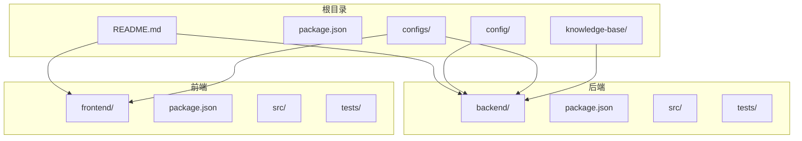
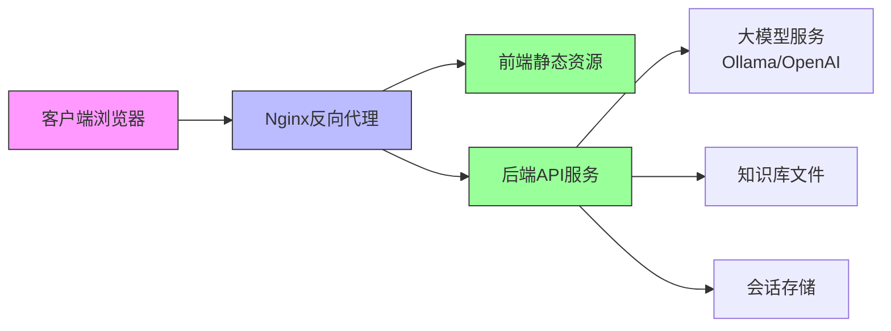
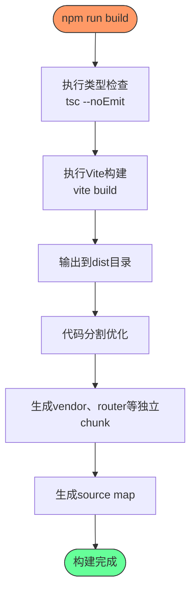
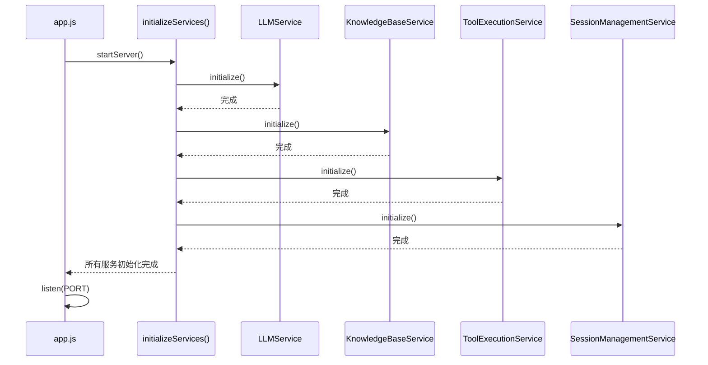
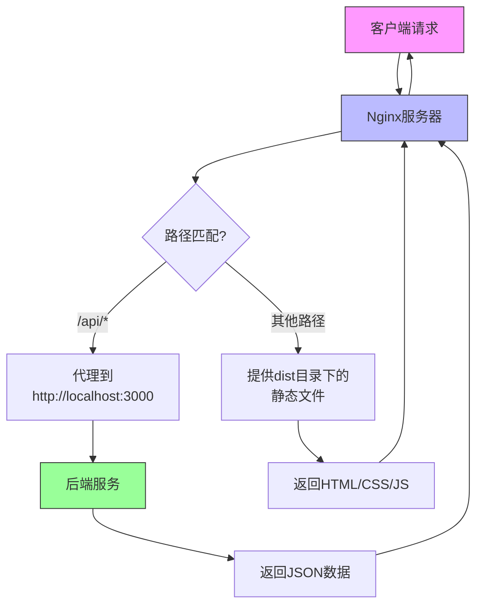
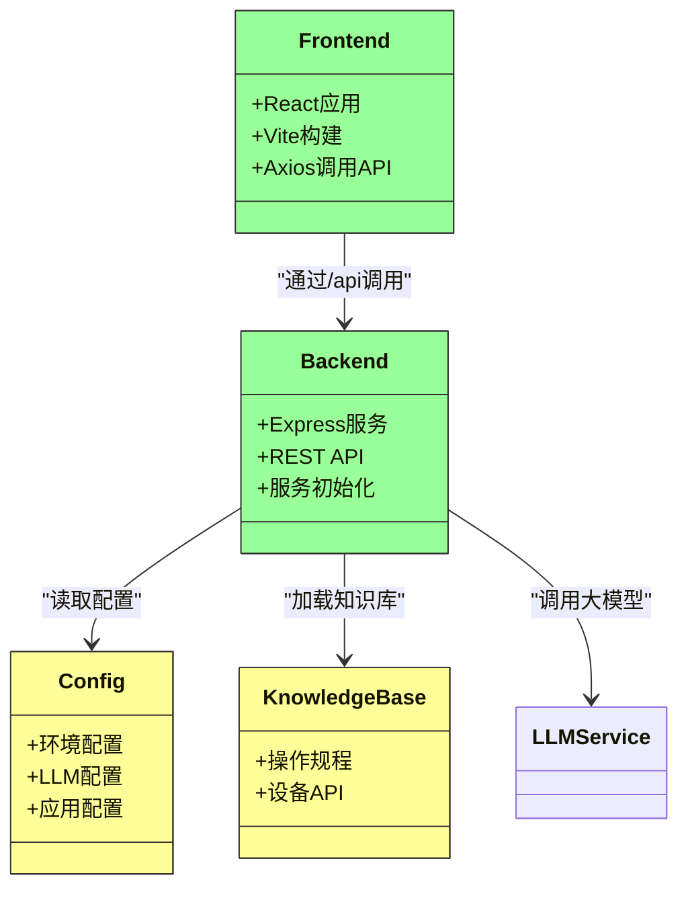
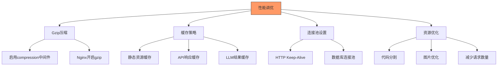
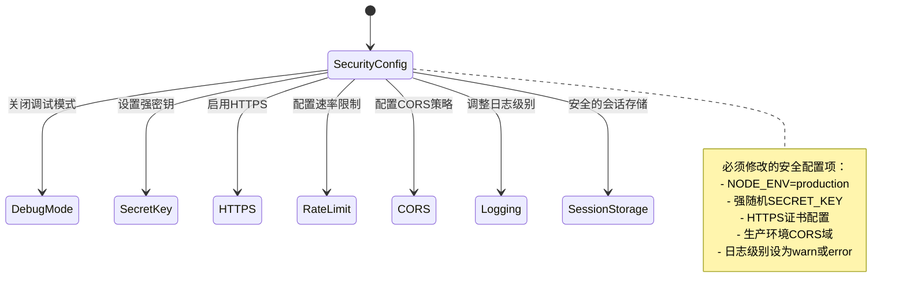

# 部署指南

<cite>
**本文档引用的文件**
- [backend/package.json](file://backend/package.json)
- [frontend/package.json](file://frontend/package.json)
- [config/production.json](file://config/production.json)
- [frontend/vite.config.ts](file://frontend/vite.config.ts)
- [backend/src/app.js](file://backend/src/app.js)
- [configs/llm-config.json](file://configs/llm-config.json)
- [configs/app-config.json](file://configs/app-config.json)
- [README.md](file://README.md)
</cite>

## 目录
1. [简介](#简介)
2. [项目结构](#项目结构)
3. [核心组件](#核心组件)
4. [架构概览](#架构概览)
5. [详细组件分析](#详细组件分析)
6. [依赖分析](#依赖分析)
7. [性能考虑](#性能考虑)
8. [故障排除指南](#故障排除指南)
9. [结论](#结论)

## 简介
本部署指南旨在为运维人员提供详细的说明，指导如何将AutoOperation系统部署到生产环境。文档涵盖了从构建静态资源、运行前后端服务，到使用Nginx进行反向代理配置的完整流程。同时讨论了单机部署、Docker容器化和Kubernetes集群等不同部署场景，并提供了性能调优建议和必要的安全配置项。

## 项目结构
该项目采用前后端分离架构，包含独立的前端和后端模块，以及共享的配置和知识库目录。整体结构清晰，便于维护和扩展。

**图示来源**
- [README.md](file://README.md#L0-L130)

**本节来源**
- [README.md](file://README.md#L0-L130)

## 核心组件
系统由前端React应用和后端Node.js服务组成，通过REST API进行通信。后端基于Express框架构建，实现了会话管理、知识库查询、工具执行和LLM服务集成等核心功能。

**本节来源**
- [backend/package.json](file://backend/package.json#L0-L48)
- [frontend/package.json](file://frontend/package.json#L0-L51)

## 架构概览
系统采用典型的前后端分离架构，前端负责用户界面展示和交互，后端处理业务逻辑和数据处理，并与大模型服务进行交互。

**图示来源**
- [backend/src/app.js](file://backend/src/app.js#L0-L147)
- [frontend/vite.config.ts](file://frontend/vite.config.ts#L0-L42)

## 详细组件分析

### 前端构建流程分析
前端使用Vite作为构建工具，TypeScript作为开发语言，支持高效的开发体验和优化的生产构建。

**图示来源**
- [frontend/package.json](file://frontend/package.json#L0-L51)
- [frontend/vite.config.ts](file://frontend/vite.config.ts#L0-L42)

**本节来源**
- [frontend/package.json](file://frontend/package.json#L0-L51)
- [frontend/vite.config.ts](file://frontend/vite.config.ts#L0-L42)

### 后端服务启动流程
后端服务在启动时按顺序初始化各个核心服务组件，确保系统稳定运行。

**图示来源**
- [backend/src/app.js](file://backend/src/app.js#L0-L147)

**本节来源**
- [backend/src/app.js](file://backend/src/app.js#L0-L147)

### Nginx反向代理配置
通过Nginx配置实现前后端统一域名访问，将API请求代理到后端服务，静态资源直接由Nginx提供。

**图示来源**
- [backend/src/app.js](file://backend/src/app.js#L0-L147)
- [frontend/vite.config.ts](file://frontend/vite.config.ts#L0-L42)

## 依赖分析
系统依赖关系清晰，前后端通过明确定义的API接口进行通信，配置文件集中管理关键参数。

**图示来源**
- [config/production.json](file://config/production.json#L0-L52)
- [configs/llm-config.json](file://configs/llm-config.json#L0-L53)
- [configs/app-config.json](file://configs/app-config.json#L0-L39)

**本节来源**
- [config/production.json](file://config/production.json#L0-L52)
- [configs/llm-config.json](file://configs/llm-config.json#L0-L53)
- [configs/app-config.json](file://configs/app-config.json#L0-L39)

## 性能考虑
系统设计时已考虑多项性能优化措施，可在生产环境中进一步调整以获得最佳性能。

### 生产环境性能调优建议

**本节来源**
- [backend/src/app.js](file://backend/src/app.js#L0-L147)
- [frontend/vite.config.ts](file://frontend/vite.config.ts#L0-L42)

## 故障排除指南
针对生产环境常见问题提供排查思路和解决方案。

### 生产环境安全配置项

**图示来源**
- [config/production.json](file://config/production.json#L0-L52)
- [backend/src/app.js](file://backend/src/app.js#L0-L147)

**本节来源**
- [config/production.json](file://config/production.json#L0-L52)
- [backend/src/app.js](file://backend/src/app.js#L0-L147)

## 结论
AutoOperation系统提供了完整的智能运维解决方案，通过合理的部署配置可以满足不同规模的生产环境需求。建议根据实际业务场景选择合适的部署方式，并严格遵循安全配置要求，确保系统稳定可靠运行。