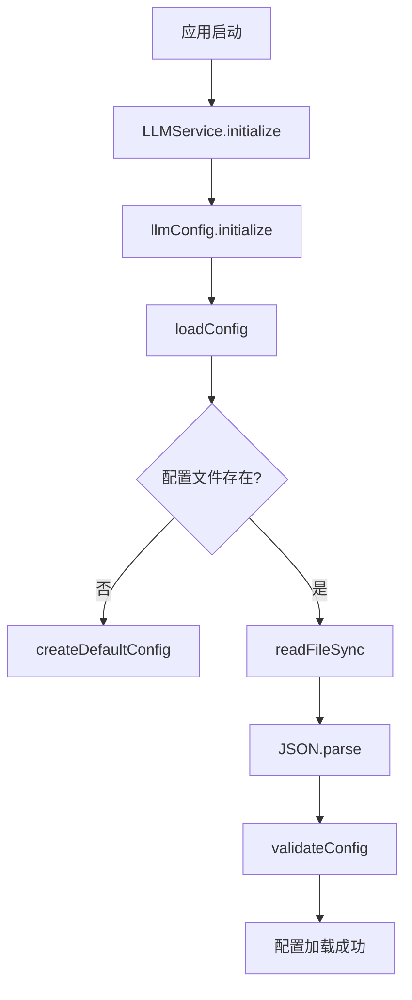
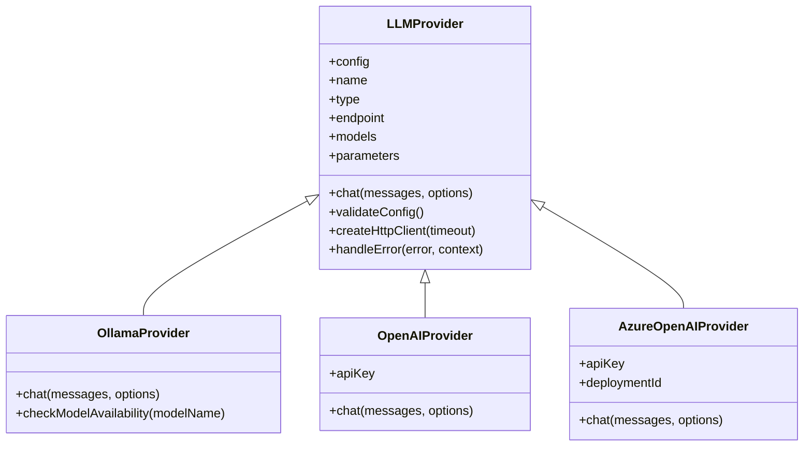
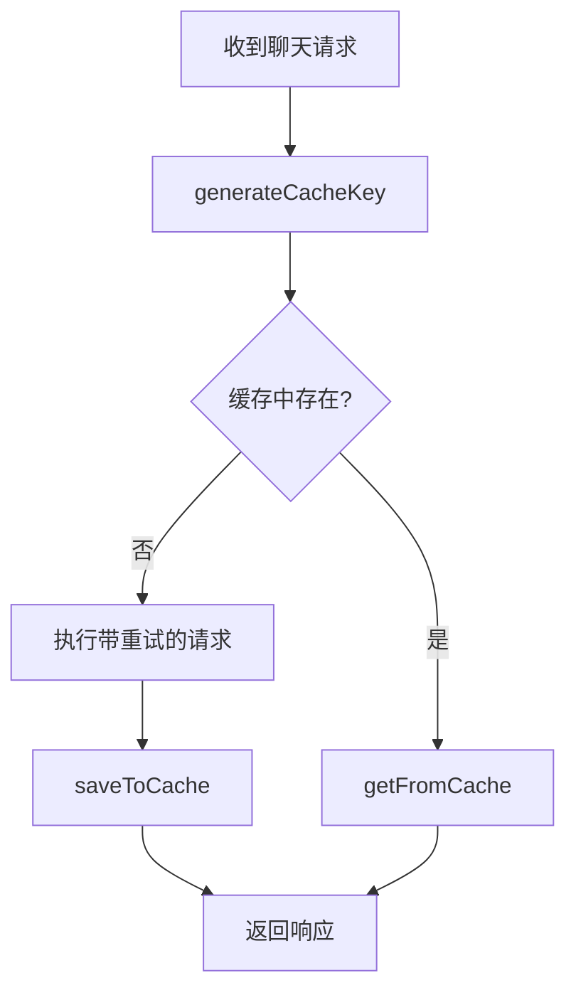

# LLM配置

<cite>
**本文档引用的文件**
- [llm-config.json](file://configs/llm-config.json)
- [LLMService.js](file://backend/src/services/LLMService.js)
- [LLMProvider.js](file://backend/src/services/LLMProvider.js)
- [LLMConfigManager.js](file://backend/src/services/LLMConfigManager.js)
</cite>

## 目录
1. [简介](#简介)
2. [核心配置解析](#核心配置解析)
3. [服务实现与行为控制](#服务实现与行为控制)
4. [故障转移与重试策略](#故障转移与重试策略)
5. [安全实践建议](#安全实践建议)

## 简介
本项目通过 `llm-config.json` 文件集中管理大语言模型（LLM）的配置，支持多种提供商（如 Ollama、OpenAI、Azure OpenAI）。该配置被 `LLMService` 和 `LLMProvider` 服务类读取并用于控制模型调用行为。系统设计了灵活的故障转移机制和缓存策略，以提升稳定性和响应效率。

## 核心配置解析

### 默认LLM提供商
在 `llm-config.json` 中，`active_provider` 字段定义了当前活跃的模型提供商。默认值为 `"ollama"`，表示使用本地运行的 Ollama 服务作为主要LLM。此设置可通过 `switchProvider` 方法动态更改。

```json
"active_provider": "ollama"
```

### 提供商配置详情
每个提供商的配置包含以下关键属性：

- **name**: 显示名称（如 "Ollama", "OpenAI"）
- **type**: 类型（"local" 或 "remote"）
- **endpoint**: API端点地址
- **models**: 主要和备用模型名称
- **parameters**: 模型生成参数
- **enabled**: 是否启用该提供商

例如，Ollama 的配置如下：
```json
"ollama": {
  "name": "Ollama",
  "type": "local",
  "endpoint": "http://localhost:11434",
  "models": {
    "primary": "llama2",
    "fallback": "qwen2"
  },
  "parameters": {
    "temperature": 0.7,
    "max_tokens": 2048,
    "top_p": 0.9,
    "timeout": 30000
  },
  "enabled": true
}
```

### API密钥占位符
对于远程提供商（如 OpenAI），API密钥使用环境变量占位符 `${OPENAI_API_KEY}` 进行配置，确保敏感信息不会硬编码在配置文件中。

```json
"api_key": "${OPENAI_API_KEY}"
```

### 请求超时设置
所有提供商的 `parameters.timeout` 字段定义了API请求的超时时间（单位：毫秒）。默认值为 `30000`（30秒），防止请求无限期挂起。

### 最大重试次数
`retry_config.max_retries` 设置了失败请求的最大重试次数。默认值为 `3`，结合指数退避策略，增强了系统的容错能力。

```json
"retry_config": {
  "max_retries": 3,
  "retry_delay": 1000,
  "backoff_factor": 2
}
```

### 上下文窗口大小
`max_tokens` 参数控制了模型生成响应的最大令牌数，间接影响上下文窗口的大小。默认值为 `2048`，平衡了性能和成本。

**Section sources**
- [llm-config.json](file://configs/llm-config.json#L1-L53)

## 服务实现与行为控制

### 配置加载与初始化
`LLMConfigManager` 负责加载和管理 `llm-config.json` 文件。它在初始化时会验证配置的有效性，并提供方法来获取解析后的配置。



**Diagram sources**
- [LLMConfigManager.js](file://backend/src/services/LLMConfigManager.js#L13-L98)
- [LLMService.js](file://backend/src/services/LLMService.js#L9-L25)

### 环境变量解析
`LLMConfigManager` 的 `resolveEnvironmentVariables` 方法递归地将配置中的 `${VAR_NAME}` 占位符替换为 `process.env.VAR_NAME` 的实际值，实现了敏感信息的安全注入。

```javascript
resolveEnvironmentVariables(value) {
  return value.replace(/\$\{([^}]+)\}/g, (match, envVar) => {
    return process.env[envVar] || match;
  });
}
```

### 提供商工厂模式
`LLMProviderFactory` 根据配置中的 `name` 字段创建相应的提供商实例（如 `OllamaProvider`, `OpenAIProvider`），实现了多提供商的统一接口调用。



**Diagram sources**
- [LLMProvider.js](file://backend/src/services/LLMProvider.js#L8-L97)
- [LLMProvider.js](file://backend/src/services/LLMProvider.js#L99-L337)

### 缓存机制
`LLMService` 实现了基于内存的响应缓存，可显著减少重复查询的延迟和成本。缓存键由输入消息和参数生成，支持TTL过期和最大容量限制。



**Diagram sources**
- [LLMService.js](file://backend/src/services/LLMService.js#L65-L154)

**Section sources**
- [LLMService.js](file://backend/src/services/LLMService.js#L9-L154)
- [LLMConfigManager.js](file://backend/src/services/LLMConfigManager.js#L213-L220)

## 故障转移与重试策略

### 重试机制
`LLMService` 的 `executeWithRetry` 方法实现了指数退避重试逻辑。当请求失败时，系统会根据 `retry_delay` 和 `backoff_factor` 计算等待时间后进行重试。

```javascript
async executeWithRetry(operation, context = '') {
  const retryConfig = llmConfig.getRetryConfig();
  for (let attempt = 1; attempt <= retryConfig.max_retries + 1; attempt++) {
    try {
      return await operation();
    } catch (error) {
      if (attempt <= retryConfig.max_retries) {
        const delay = retryConfig.retry_delay * Math.pow(retryConfig.backoff_factor, attempt - 1);
        await new Promise(resolve => setTimeout(resolve, delay));
      }
    }
  }
}
```

### 健康检查
`healthCheck` 方法可用于检测当前LLM提供商的可用性，这对于实现自动故障转移至关重要。

```javascript
async healthCheck() {
  try {
    const response = await this.chat([{ role: 'user', content: '测试' }]);
    return { healthy: true, ...response };
  } catch (error) {
    return { healthy: false, error: error.message };
  }
}
```

**Section sources**
- [LLMService.js](file://backend/src/services/LLMService.js#L156-L331)
- [LLMService.js](file://backend/src/services/LLMService.js#L333-L371)

## 安全实践建议

### 避免暴露真实密钥
绝对不要将真实的API密钥直接写入 `llm-config.json` 文件。应始终使用环境变量占位符（如 `${OPENAI_API_KEY}`），并在运行时通过 `.env` 文件或系统环境变量注入。

### 使用环境变量
推荐在项目根目录创建 `.env` 文件来存储敏感信息：

```bash
OPENAI_API_KEY=your_actual_openai_key_here
AZURE_OPENAI_ENDPOINT=https://your-endpoint.openai.azure.com
AZURE_OPENAI_API_KEY=your_azure_key
AZURE_DEPLOYMENT_ID=your_deployment_id
```

然后在启动应用前加载这些环境变量。

### 配置文件权限
确保 `llm-config.json` 文件的权限设置为仅允许授权用户读取，避免敏感信息泄露。

### 动态切换提供商
利用 `switchProvider` 方法可以在运行时安全地切换到备用提供商，而无需重启服务，提高了系统的灵活性和可用性。

```javascript
await llmService.switchProvider('openai');
```

**Section sources**
- [LLMConfigManager.js](file://backend/src/services/LLMConfigManager.js#L268-L319)
- [LLMService.js](file://backend/src/services/LLMService.js#L285-L295)