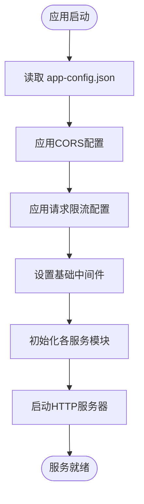

# 应用配置

<cite>
**本文档引用的文件**
- [app-config.json](file://configs/app-config.json)
- [app.js](file://backend/src/app.js)
- [security.js](file://backend/src/middleware/security.js)
- [logger.js](file://backend/src/utils/logger.js)
- [default.json](file://config/default.json)
- [development.json](file://config/development.json)
- [production.json](file://config/production.json)
</cite>

## 目录
1. [应用级配置参数详解](#应用级配置参数详解)
2. [配置加载与应用流程](#配置加载与应用流程)
3. [配置生效方式](#配置生效方式)
4. [开发与生产环境配置实践](#开发与生产环境配置实践)

## 应用级配置参数详解

### 服务器配置（server）
- **port**: 服务器监听端口，允许值为有效端口号（0-65535），默认值为3000。该配置决定Express应用实例绑定的网络端口。
- **host**: 服务器绑定主机地址，默认值为"0.0.0.0"，表示接受所有网络接口的连接请求。
- **api_prefix**: 基础API路径前缀，默认值为"/api/v1"，所有API路由将基于此路径进行注册。

### 跨域资源共享配置（cors）
- **origin**: 允许访问的源列表，类型为字符串数组。当前配置允许来自`http://localhost:5173`和`http://localhost:3000`的跨域请求。
- **credentials**: 是否允许携带凭据（如cookies），布尔值，默认为true。

### 请求限流配置（rate_limiting）
- **window_ms**: 时间窗口长度（毫秒），默认900000（15分钟）。
- **max_requests**: 每个时间窗口内最大请求数，当前设置为100次。
- **message**: 超出限制时返回的提示信息，中文内容为"请求过于频繁，请稍后再试"。

### 日志配置（logging）
- **level**: 日志输出级别，可选值包括"error"、"warn"、"info"、"debug"等，当前设置为"info"。
- **file_rotation**: 是否启用日志文件轮转，布尔值。
- **max_file_size**: 单个日志文件最大大小，当前为"5MB"。
- **max_files**: 保留的最大日志文件数量，当前为5个。

### 会话管理配置（session_management）
- **enable_file_storage**: 是否启用文件存储会话数据，布尔值。
- **auto_save**: 是否自动保存会话，布尔值。
- **save_interval**: 自动保存间隔（毫秒），当前为30000（30秒）。
- **max_sessions_in_memory**: 内存中最大会话数，当前为1000。
- **session_ttl**: 会话生存时间（毫秒），当前为86400000（24小时）。

### 知识库配置（knowledge_base）
- **auto_reload**: 是否自动重载知识库内容，布尔值。
- **cache_enabled**: 是否启用缓存，布尔值。
- **search_result_limit**: 搜索结果最大返回数量，当前为50条。

### 工具执行配置（tool_execution）
- **timeout**: 执行超时时间（毫秒），当前为30000（30秒）。
- **max_retries**: 最大重试次数，当前为3次。
- **retry_delay**: 首次重试延迟时间（毫秒），当前为1000（1秒）。
- **retry_backoff_factor**: 重试退避因子，用于计算后续重试间隔，当前为2。

**Section sources**
- [app-config.json](file://configs/app-config.json#L1-L39)

## 配置加载与应用流程

系统在启动时通过`app.js`中的初始化逻辑读取并应用配置。虽然`app.js`直接使用了`process.env.PORT`作为端口，但其他中间件配置（如CORS、请求限流等）均从`app-config.json`获取参数。

**Diagram sources**
- [app.js](file://backend/src/app.js#L1-L147)
- [security.js](file://backend/src/middleware/security.js#L1-L200)

**Section sources**
- [app.js](file://backend/src/app.js#L1-L147)
- [security.js](file://backend/src/middleware/security.js#L1-L200)

## 配置生效方式

修改`app-config.json`中的任何配置项后，必须重启服务才能使更改生效。这是因为配置在应用启动时一次性加载到内存中，并未实现热重载机制。例如：
- 修改`server.port`需重启以绑定新端口
- 修改`logging.level`需重启以调整日志输出级别
- 修改`cors.origin`需重启以更新允许的源列表

**Section sources**
- [app.js](file://backend/src/app.js#L113-L129)

## 开发与生产环境配置实践

项目提供了多环境配置方案，位于`config/`目录下：

- **default.json**: 默认配置，包含所有环境共享的基础设置
- **development.json**: 开发环境专用配置，日志级别设为"debug"，文件日志禁用
- **production.json**: 生产环境配置，使用环境变量占位符（如`${PORT}`），日志级别设为"warn"

对比示例：
| 配置项 | 开发环境 | 生产环境 |
|--------|----------|----------|
| 日志级别 | debug | warn |
| 文件日志 | 禁用 | 启用 |
| CORS源 | 多个本地地址 | 通过环境变量指定 |
| 请求限制 | 较宽松 | 标准限制 |

这种分层配置模式允许在不同部署环境中灵活调整参数，同时保持核心逻辑一致。

**Section sources**
- [default.json](file://config/default.json#L1-L86)
- [development.json](file://config/development.json#L1-L44)
- [production.json](file://config/production.json#L1-L52)