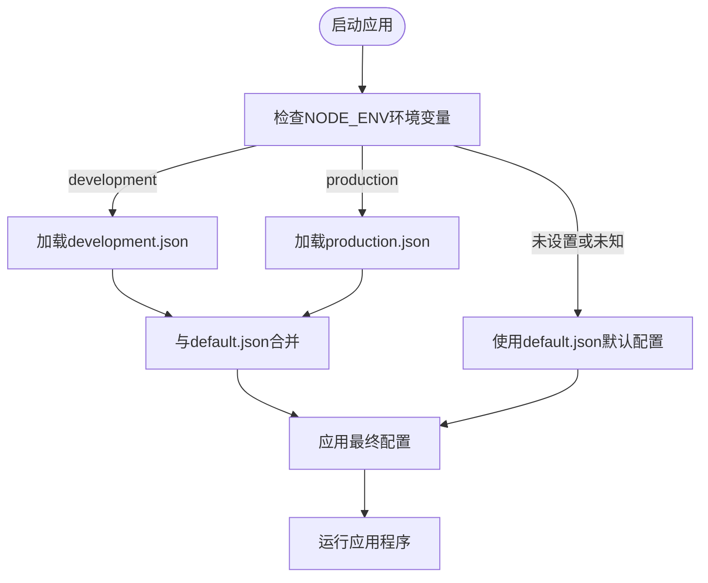
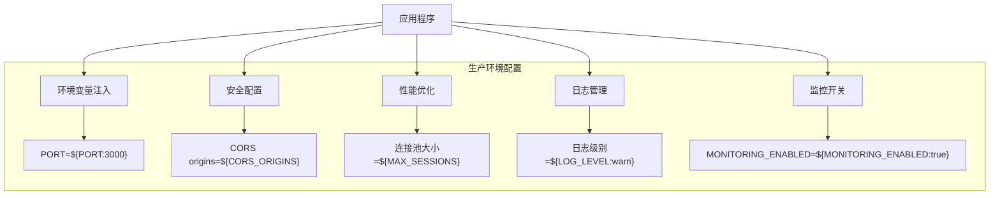

# 环境配置

<cite>
**本文档引用的文件**
- [default.json](file://config/default.json)
- [development.json](file://config/development.json)
- [production.json](file://config/production.json)
- [app.js](file://backend/src/app.js)
</cite>

## 目录
1. [多环境配置机制](#多环境配置机制)
2. [默认配置基础作用](#默认配置基础作用)
3. [开发环境配置](#开发环境配置)
4. [生产环境配置](#生产环境配置)
5. [配置合并与优先级](#配置合并与优先级)
6. [部署验证建议](#部署验证建议)

## 多环境配置机制

本项目采用 node-config 库实现多环境配置管理，通过 NODE_ENV 环境变量自动加载对应的配置文件。系统在运行时会根据当前环境变量值选择相应的配置文件进行加载和合并，确保应用程序能够在不同环境中以最优设置运行。

**Section sources**
- [default.json](file://config/default.json)
- [development.json](file://config/development.json)
- [production.json](file://config/production.json)

## 默认配置基础作用

`default.json` 文件作为全局默认配置的基础，定义了应用程序在所有环境中共享的基本配置项。该文件包含了应用名称、版本、端口、主机地址、LLM 模型配置、知识库路径、会话存储设置、安全策略、日志级别和监控功能等核心参数。当特定环境未覆盖某个配置项时，系统将使用 default.json 中的默认值。

**Diagram sources**
- [default.json](file://config/default.json)

**Section sources**
- [default.json](file://config/default.json)

## 开发环境配置

`development.json` 文件专为本地开发调试设计，包含了一系列便于开发和测试的配置优化。该配置文件修改了应用端口为 3001，启用了详细的调试日志输出（日志级别设为 debug），禁用了日志文件写入以减少磁盘 I/O，扩展了 CORS 允许的源列表，并提高了速率限制阈值。此外，LLM 提供商被设置为 mock 模式，便于在无实际 AI 服务的情况下进行功能测试。

**Section sources**
- [development.json](file://config/development.json)

## 生产环境配置

`production.json` 文件针对生产环境进行了专门优化，确保系统在高负载下的稳定性和安全性。该配置文件使用环境变量占位符（如 ${PORT:3000}）来动态获取关键参数，关闭了控制台日志输出（日志级别设为 warn），增强了安全策略，调整了连接池大小和超时设置。同时，通过环境变量注入敏感信息（如 API 密钥），避免硬编码带来的安全风险。

**Diagram sources**
- [production.json](file://config/production.json)

**Section sources**
- [production.json](file://config/production.json)

## 配置合并与优先级

Node.js 运行时根据 NODE_ENV 环境变量自动合并配置，遵循明确的优先级规则：环境特定配置 > 默认配置。在 `backend/src/app.js` 中，虽然没有显式导入 config 模块，但整个应用依赖于 node-config 库的自动加载机制。配置优先级从高到低依次为：环境变量 > 环境特定配置文件 > default.json。这意味着可以在部署时通过设置环境变量来覆盖任何配置项，提供了最大的灵活性和安全性。

**Section sources**
- [app.js](file://backend/src/app.js)
- [default.json](file://config/default.json)
- [production.json](file://config/production.json)

## 部署验证建议

在部署前，开发者必须验证环境变量与配置文件的一致性，确保生产环境的安全性和稳定性。建议执行以下检查：确认所有必需的环境变量已正确设置，验证敏感信息（如 API 密钥）未硬编码在配置文件中，检查端口和主机配置是否符合目标环境要求，测试日志级别设置是否恰当，以及确认安全策略（如 CORS 和速率限制）已按生产标准配置。可以通过健康检查端点 `/health` 和系统状态端点 `/status` 来验证配置是否正确加载并生效。

**Section sources**
- [app.js](file://backend/src/app.js)
- [production.json](file://config/production.json)