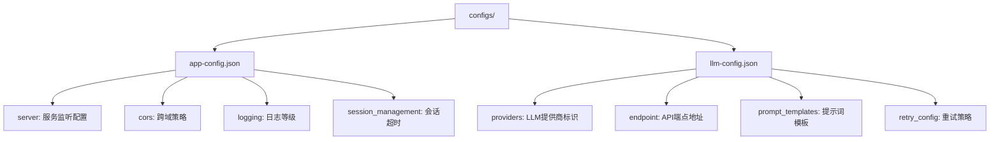
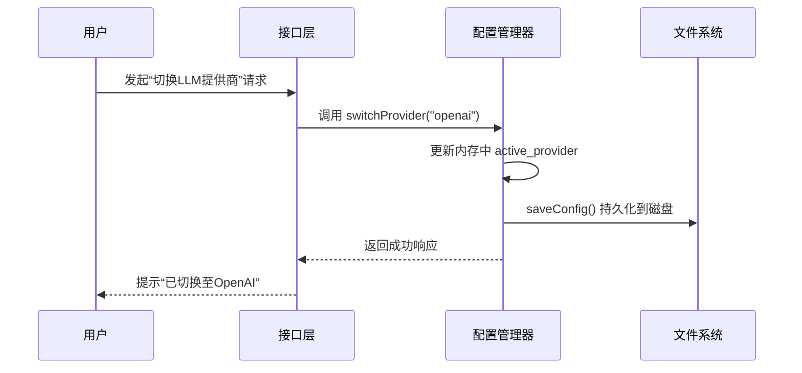

# 配置管理

<cite>
**本文档引用文件**  
- [app-config.json](file://configs/app-config.json)
- [llm-config.json](file://configs/llm-config.json)
- [default.json](file://config/default.json)
- [development.json](file://config/development.json)
- [production.json](file://config/production.json)
- [LLMConfigManager.js](file://backend/src/services/LLMConfigManager.js)
</cite>

## 目录
1. [配置体系概述](#配置体系概述)
2. [应用级与大模型专用配置对比](#应用级与大模型专用配置对比)
3. [环境配置机制详解](#环境配置机制详解)
4. [可配置项清单及默认值](#可配置项清单及默认值)
5. [配置变更生效策略](#配置变更生效策略)
6. [配置修改风险警示](#配置修改风险警示)

## 配置体系概述

本系统采用分层配置管理体系，结合静态JSON配置文件与动态环境变量解析机制。整体架构分为两个主要目录：`configs/` 用于存放核心业务功能的专用配置，`config/` 基于 node-config 框架实现多环境差异化配置。

该体系支持运行时动态加载、环境变量注入、配置验证和热重载能力，确保系统在不同部署场景下的灵活性与稳定性。

**Section sources**
- [app-config.json](file://configs/app-config.json)
- [llm-config.json](file://configs/llm-config.json)
- [default.json](file://config/default.json)

## 应用级与大模型专用配置对比

### 功能定位差异

| 配置文件 | 所在路径 | 主要用途 |
|--------|---------|--------|
| **应用级配置** | `configs/app-config.json` | 定义系统通用行为参数，如服务器设置、日志级别、会话管理等 |
| **大模型专用配置** | `configs/llm-config.json` | 管理大语言模型相关参数，包括提供商选择、API端点、提示模板等 |

### 结构与职责划分



**Diagram sources**
- [app-config.json](file://configs/app-config.json)
- [llm-config.json](file://configs/llm-config.json)

#### 应用级配置（app-config.json）
此文件控制整个系统的非AI核心模块行为：
- 服务器端口绑定与主机监听地址
- CORS跨域白名单及凭证支持
- 请求频率限制规则
- 文件存储路径与轮转策略
- 工具执行超时与重试机制

#### 大模型专用配置（llm-config.json）
专为AI能力设计的精细化控制：
- 支持多提供商注册（Ollama、OpenAI、Azure等）
- 可动态切换活跃模型提供商
- 包含温度、最大token数等生成参数
- 内置标准化提示模板（问题分析、步骤生成、结果评估）
- 缓存策略与故障转移机制

**Section sources**
- [app-config.json](file://configs/app-config.json#L1-L39)
- [llm-config.json](file://configs/llm-config.json#L1-L53)
- [LLMConfigManager.js](file://backend/src/services/LLMConfigManager.js#L13-L314)

## 环境配置机制详解

系统使用 `node-config` 第三方库实现环境感知型配置加载机制，通过 `NODE_ENV` 环境变量自动合并基础配置与环境特定覆盖。

### 配置继承结构

```mermaid
classDiagram
class default_json {
+app.name
+app.port
+llm.provider
+security.cors.origin[]
+logging.level
}
class development_json {
+app.port = 3001
+logging.level = debug
+security.cors.origin[] + additional hosts
}
class production_json {
+app.port = ${PORT : 3000}
+logging.level = ${LOG_LEVEL : warn}
+security.cors.origin = ${CORS_ORIGINS}
}
development_json --|> default_json : extends
production_json --|> default_json : extends
```

**Diagram sources**
- [default.json](file://config/default.json)
- [development.json](file://config/development.json)
- [production.json](file://config/production.json)

### 加载优先级规则

1. **基础配置**：`default.json` 提供所有字段的默认值
2. **环境覆盖**：根据 `NODE_ENV` 加载对应环境文件进行深度合并
3. **环境变量注入**：`${VAR_NAME:default}` 格式占位符被系统环境变量替换
4. **运行时解析**：由 `LLMConfigManager.getResolvedProvider()` 方法完成最终解析

例如，在生产环境中：
```json
"port": "${PORT:3000}"
```
将优先读取操作系统环境变量 `PORT`，若未设置则使用默认值 `3000`。

**Section sources**
- [default.json](file://config/default.json#L1-L86)
- [development.json](file://config/development.json#L1-L44)
- [production.json](file://config/production.json#L1-L52)

## 可配置项清单及默认值

### 全局服务参数

| 配置项 | 默认值 | 说明 |
|-------|------|-----|
| 服务器端口 | 3000 | `app-config.json` 中 server.port |
| 日志级别 | info | `app-config.json` logging.level；生产环境为 warn |
| 会话超时时间 | 86400000ms (24小时) | `app-config.json` session_management.session_ttl |
| LLM提供商标识 | ollama | `llm-config.json` active_provider |
| API端点地址 | http://localhost:11434 | `llm-config.json` providers.ollama.endpoint |

### 各模块详细配置表

#### 应用服务配置（app-config.json）

| 类别 | 配置键 | 类型 | 默认值 | 描述 |
|------|--------|------|--------|------|
| 服务器 | server.port | number | 3000 | HTTP监听端口 |
| 服务器 | server.host | string | 0.0.0.0 | 绑定IP地址 |
| CORS | cors.origin[] | array | ["http://localhost:5173"] | 允许的前端源 |
| 限流 | rate_limiting.max_requests | number | 100 | 每15分钟最大请求数 |
| 日志 | logging.level | string | info | 日志输出等级 |
| 会话 | session_management.session_ttl | number | 86400000 | 会话有效期（毫秒） |
| 工具执行 | tool_execution.timeout | number | 30000 | 单个工具执行超时（毫秒） |

#### 大模型服务配置（llm-config.json）

| 类别 | 配置键 | 类型 | 默认值 | 描述 |
|------|--------|------|--------|------|
| 活跃提供商 | active_provider | string | ollama | 当前使用的LLM服务商 |
| 模型参数 | providers.ollama.parameters.temperature | number | 0.7 | 生成随机性控制 |
| 模型参数 | providers.ollama.parameters.max_tokens | number | 2048 | 最大输出长度 |
| 连接 | providers.openai.api_key | string | ${OPENAI_API_KEY} | API密钥占位符 |
| 重试 | retry_config.max_retries | number | 3 | 失败后最大重试次数 |
| 缓存 | cache_config.ttl | number | 3600 | 缓存存活时间（秒） |

**Section sources**
- [app-config.json](file://configs/app-config.json#L1-L39)
- [llm-config.json](file://configs/llm-config.json#L1-L53)
- [default.json](file://config/default.json#L1-L86)

## 配置变更生效策略

### 静态配置文件更新流程

1. **编辑配置文件**：直接修改 `app-config.json` 或 `llm-config.json`
2. **保存更改**：确保JSON语法正确无误
3. **重启服务**：必须重新启动后端应用以加载新配置

> ⚠️ 注意：`configs/` 下的文件不支持热重载，必须重启生效。

### 动态配置更新接口

对于 `llm-config.json`，系统提供了运行时操作能力：



**Diagram sources**
- [LLMConfigManager.js](file://backend/src/services/LLMConfigManager.js#L213-L275)

此类变更无需重启即可立即生效，适用于A/B测试或多模型快速切换场景。

**Section sources**
- [LLMConfigManager.js](file://backend/src/services/LLMConfigManager.js#L213-L275)

## 配置修改风险警示

### 不当修改可能导致的问题

| 错误类型 | 可能后果 | 预防措施 |
|--------|--------|--------|
| JSON格式错误 | 服务无法启动，报错“Unexpected token” | 使用JSON校验工具预检 |
| 必填字段缺失 | 初始化失败，抛出“缺少必需字段”异常 | 参照默认配置模板填写 |
| 端口号被占用 | 启动时报“EADDRINUSE”错误 | 检查端口占用情况 |
| API密钥未设置 | 调用远程LLM时报401 Unauthorized | 确保环境变量已导出 |
| CORS