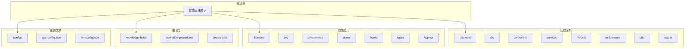
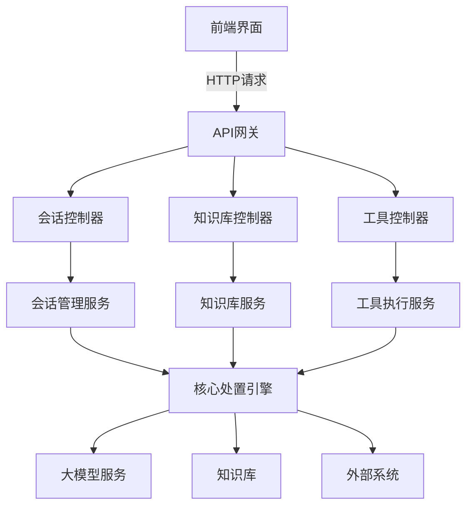

# 项目概述

<cite>
**本文档引用的文件**
- [README.md](file://README.md)
- [PROJECT_SUMMARY.md](file://PROJECT_SUMMARY.md)
- [智能运维助手应用程序需求.md](file://智能运维助手应用程序需求.md)
- [sessionController.js](file://backend/src/controllers/sessionController.js)
- [knowledgeController.js](file://backend/src/controllers/knowledgeController.js)
- [toolController.js](file://backend/src/controllers/toolController.js)
- [SessionManagementService.js](file://backend/src/services/SessionManagementService.js)
- [KnowledgeBaseService.js](file://backend/src/services/KnowledgeBaseService.js)
- [ToolExecutionService.js](file://backend/src/services/ToolExecutionService.js)
- [ProcessingEngine.js](file://backend/src/services/ProcessingEngine.js)
- [LLMService.js](file://backend/src/services/LLMService.js)
- [cpu-high-usage.md](file://knowledge-base/operation-procedures/cpu-high-usage.md)
- [network-issues.md](file://knowledge-base/operation-procedures/network-issues.md)
</cite>

## 目录
1. [简介](#简介)
2. [项目结构](#项目结构)
3. [核心组件](#核心组件)
4. [架构概览](#架构概览)
5. [详细组件分析](#详细组件分析)
6. [依赖关系分析](#依赖关系分析)
7. [性能考量](#性能考量)
8. [故障排除指南](#故障排除指南)
9. [结论](#结论)

## 简介

智能运维助手是一个基于大语言模型的智能化运维处置系统，旨在通过人机协作实现渐进式的问题处置流程。该系统结合了先进的AI技术与丰富的运维知识库，为用户提供从问题诊断、方案生成到自动化执行的完整解决方案。

系统采用现代化的技术栈，前端使用React 18 + TypeScript构建响应式Web界面，后端基于Node.js 18+ + Express框架提供稳定的服务支持。通过集成多种大模型提供商（如Ollama、OpenAI等），系统能够深度分析运维问题现象，并生成结构化的处置方案。

本系统的核心价值在于其"渐进式处置引导"机制，既支持对具备API支持的步骤进行自动执行，也允许用户在关键环节进行手动确认和干预。这种混合模式确保了处置过程的安全性和灵活性，同时显著提升了运维效率。

**Section sources**
- [README.md](file://README.md#L1-L129)
- [PROJECT_SUMMARY.md](file://PROJECT_SUMMARY.md#L1-L144)

## 项目结构

智能运维助手采用前后端分离的微服务架构，整体项目结构清晰且模块化程度高。



**Diagram sources**
- [README.md](file://README.md#L100-L120)

**Section sources**
- [README.md](file://README.md#L100-L120)

## 核心组件

系统由多个核心组件构成，主要包括会话管理、知识库管理和工具执行三大服务模块。

会话管理服务负责维护用户的整个问题处置流程，包括会话创建、状态跟踪、步骤执行和历史记录等功能。每个会话都包含完整的上下文信息，支持断点续传和跨设备同步。

知识库管理服务集成了运维处置知识库和设备操作API知识库，前者提供了各种问题的标准处置流程文档，后者则定义了可自动化执行的操作接口及其参数规范。

工具执行服务作为连接系统与外部系统的桥梁，负责调用具体的API接口完成自动化操作，并处理执行结果和异常情况。

**Section sources**
- [PROJECT_SUMMARY.md](file://PROJECT_SUMMARY.md#L20-L40)
- [智能运维助手应用程序需求.md](file://智能运维助手应用程序需求.md#L1-L43)

## 架构概览

系统采用分层架构设计，从前端交互界面到后端业务逻辑再到数据存储，各层职责分明且松耦合。



**Diagram sources**
- [sessionController.js](file://backend/src/controllers/sessionController.js#L1-L241)
- [knowledgeController.js](file://backend/src/controllers/knowledgeController.js#L1-L166)
- [toolController.js](file://backend/src/controllers/toolController.js#L1-L149)

**Section sources**
- [README.md](file://README.md#L50-L80)
- [PROJECT_SUMMARY.md](file://PROJECT_SUMMARY.md#L60-L80)

## 详细组件分析

### 会话管理服务分析

会话管理服务是系统的核心协调者，负责管理用户从问题提出到解决的完整生命周期。

#### 类图
```mermaid
classDiagram
    class SessionManagementService {
        +Map sessions
        +Boolean initialized
        +Object config
        +Timer saveTimer
        +initialize(config) Promise~void~
        +createSession(problemCategory, problemDescription, userId) Promise~Object~
        +getSession(sessionId) Promise~Object~
        +updateSession(sessionId, updates) Promise~Object~
        +executeStep(sessionId, stepId, executionType, userInput) Promise~Object~
        +processFeedback(sessionId, stepId, feedback) Promise~Object~
        +completeSession(sessionId, summary) Promise~Object~
        +deleteSession(sessionId) Promise~void~
        +getUserSessions(userId, limit, offset) Object
        +searchSessions(query, filters) Object
        +getStatistics() Object
        +exportSessionData(sessionId, format) Promise~string~
        +getServiceStatus() Object
        +shutdown() Promise~void~
    }
    
    class Session {
        +String session_id
        +String problem_category
        +String problem_description
        +String user_id
        +String status
        +String created_at
        +String updated_at
        +Array steps
        +toJSON() Object
        +fromJSON(data) Session
    }
    
    class Step {
        +String step_id
        +String session_id
        +Number step_order
        +String step_type
        +String step_content
        +String execution_status
        +Object execution_result
        +Array user_feedback
